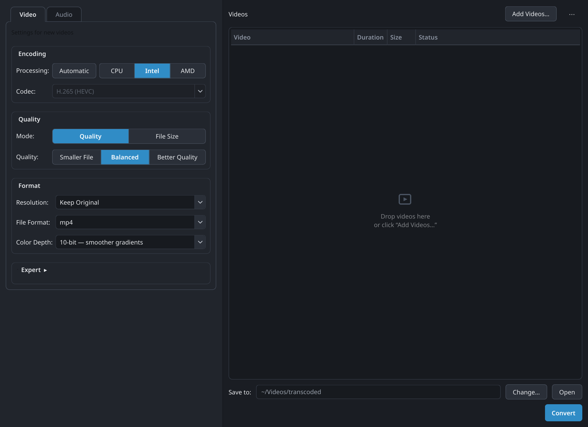
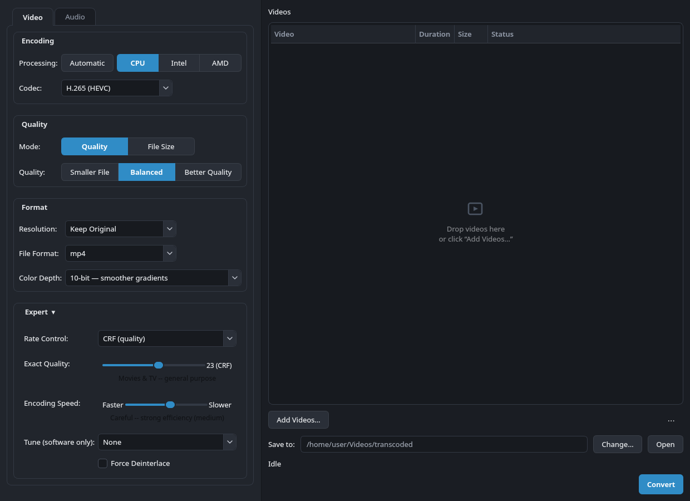
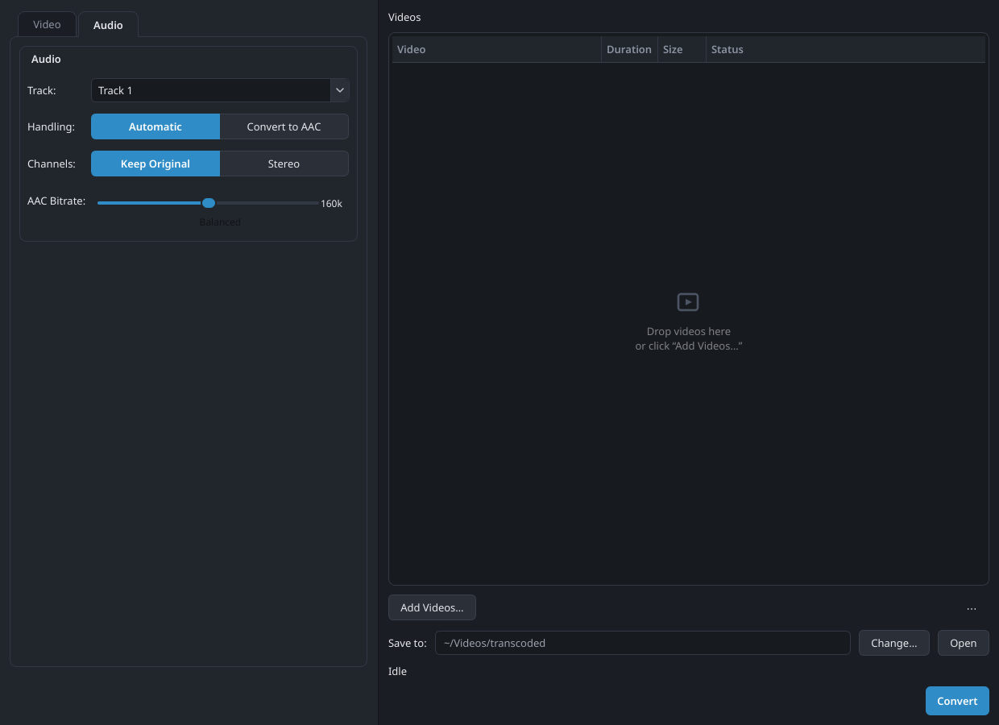
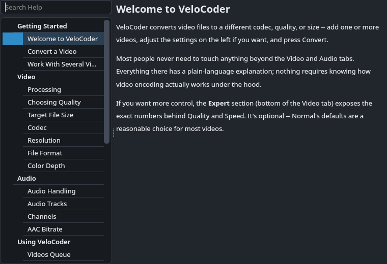
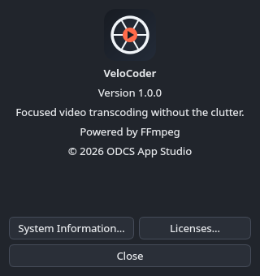
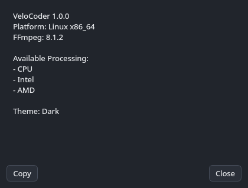

# VeloCoder

A focused desktop video transcoder built with PySide6 and ffmpeg --
originally a minimal front-end replacing HandBrake, whose QSV path is
dead on this box (see Root cause below). PySide6 GUI queue, one file at
a time.

- H.265 (HEVC) / H.264 (AVC), CPU / Intel iGPU / AMD GPU processing
- Quality-first or target-file-size workflows, MP4 / MKV, 8-bit / 10-bit
- Audio: copy-through when compatible, AAC conversion, stereo downmix
- Batch queue with automatic interlace detection and live per-file edits
- An "Expert" section for exact rate-control values, tune, and deinterlace
  overrides -- Normal mode never needs it; it's there when you do

Forked from a sibling, more exposed-by-default build ("TITAN-i
Transcoder") -- same ffmpeg engine and settings model, same everything
below this section (shared history, unchanged). This fork's own
difference is the UI layer: Normal mode surfaces every real output/media
decision in plain language above a collapsed-by-default Expert section
holding the remaining encoder-mechanics controls -- no capability lost,
just organized around "Normal = intent, Expert = actual encoder
mechanics" instead of exposing everything flat. See Controls below for
the current, full breakdown.

## Screenshots



 

## Status

Linux-first development build, not yet packaged for distribution --
`launch.sh` currently assumes a local Python virtualenv with PySide6
installed and a system `ffmpeg`/`ffprobe` on `PATH`, not a bundled
runtime. A self-contained build (bundled Python + ffmpeg, real app
icon, `.desktop` entry) is planned but not done yet.

## Run from source

```
python3 -m venv .venv
source .venv/bin/activate
pip install -r requirements.txt
python3 main.py
```

(`./launch.sh` does the same thing, but currently points at this
machine's own venv path -- edit it, or use the three commands above
directly, until that's made portable.)

## Root cause of the HandBrake QSV failure

Not a Flatpak sandboxing issue. Debian trixie dropped `libmfx1` (the legacy
Media SDK runtime needed by this Gen9.5 Comet Lake iGPU) and only packages
`libmfx-gen1.2` (oneVPL, Gen12+ only — wrong generation for this hardware
regardless). ffmpeg's own build confirms the same gap: `ffmpeg -version`
shows `--disable-libmfx --enable-libvpl`, so `hevc_qsv` is equally dead here,
in ffmpeg or HandBrake, native or Flatpak. The hardware and driver are fine —
`vainfo` against the Intel node shows the `iHD` driver loading with H264 and
HEVC (8-bit and Main10) `EncSlice` entrypoints.

**Note:** HEVC on this hardware only exposes `EncSlice` (non-low-power), not
`EncSliceLP` — H264 has both. Never add `-low_power 1` to the HEVC VAAPI
args; it isn't available for HEVC here and will fail. (`tests/test_worker.py`
has a regression test pinning this down.)

## Fix: ffmpeg's VAAPI encoders, direct

`hevc_vaapi` talks to the `iHD` VAAPI driver directly via the same
`EncSliceLP`-adjacent path QSV would have used, skipping Intel's MFX/oneVPL
dispatch layer entirely.

## GPU device selection gotcha

The two GPUs' PCI bus IDs do **not** match their render node numbers:

- Intel UHD 630: PCI `00:02.0` → `/dev/dri/renderD129`
- AMD RX 6600 XT: PCI `03:00.0` → `/dev/dri/renderD128`

`worker.find_render_node()` resolves this via `/dev/dri/by-path/pci-*-render`
symlinks + PCI vendor ID (`0x8086` = Intel), never a hardcoded node number.
If GPU selection code is touched again, keep using that approach.

## VAAPI mid-stream reconfiguration crash

A real ~2-hour source file (`ffprobe` showed `color_range`/`color_space`/
`color_transfer`/`color_primaries` all `unknown` at the container level —
nothing overriding what the decoder infers from the bitstream itself as it
goes) failed a real VAAPI encode partway through, every time, at the exact
same timestamp:

```
[vf#0:0] Reconfiguring filter graph because video parameters changed to yuv420p(tv, bt709), 1920x1080, unspecified alph
Impossible to convert between the formats supported by the filter 'Parsed_scale_vaapi_2' and the filter 'auto_scale_1'
[vf#0:0] Error reinitializing filters!
```

What's actually happening: this specific file's encoded bitstream signals
slightly different color parameters partway through (no container-level
metadata around to keep that consistent), which is a real, valid thing for
ffmpeg's decoder to detect and triggers a genuine filter-graph
reconfiguration mid-job — not a bug in this app's own command line. The
crash is ffmpeg's *response* to that: its default behavior tries to
auto-insert a software scale filter (`auto_scale_1`, a filter this app
never asked for) to bridge what it thinks is a format mismatch, and that
auto-inserted filter can never actually work against a `vaapi` hardware
surface — plain software scale filters don't understand hardware frames at
all. The whole job dies on a source property that has nothing to do with
resolution, bit depth, or any setting actually exposed in this app's UI.

Fix: `-noautoscale` on the output, for `hevc_vaapi` jobs only
(`worker.build_args`). It disables ffmpeg's auto-insert entirely — this
app's own explicit `scale_vaapi` already does all the scaling that's
actually needed, so there was never anything for the auto-inserted filter
to usefully contribute in the first place. Confirmed against the real
file, not assumed: the exact same "Reconfiguring filter graph" line still
appears at the exact same timestamp (the underlying trigger is real and
unavoidable), but encoding now continues cleanly past it instead of
crashing, verified against a real output file all the way through. Scoped
to `is_vaapi` specifically, not applied to `libx265` too — there's no
vaapi surface in that pipeline for this exact failure to happen to, so
there's nothing to fix there, and carrying an untested behavior change
into a path that was never broken isn't worth the risk. See
`tests.TestBuildArgsVaapi.test_sets_noautoscale` /
`TestBuildArgsX265.test_no_noautoscale_for_cpu_encoder`.

## Project layout

```
constants.py         Static config: encoders, rate-control modes,
                      resolutions, quality tiers, audio bitrates, and
                      the app-identity constants (APP_NAME/APP_VERSION/
                      APP_ORGANIZATION -- see that constant block's own
                      comment for why APP_ORGANIZATION never reaches
                      QSettings/QStandardPaths).
session.py            Cross-session queue/output-folder persistence --
                      a small JSON file (QStandardPaths.AppDataLocation),
                      deliberately not QSettings (see its own docstring).
help_content.py       Loads help/index.json + help/*.md, plus plain-
                      text search and a hand-rolled markdown-subset
                      renderer (headings/paragraphs/bullets/bold only --
                      no third-party markdown dependency). No Qt here.
help_window.py        HelpWindow: the non-modal, searchable built-in
                      Help window (search field + category/topic tree +
                      article viewer) -- see Help & About below.
help/                 Help content: index.json (category/topic/keyword
                      structure) + one *.md file per topic.
about_dialogs.py       AboutDialog/SystemInfoDialog/LicensesDialog --
                      see Help & About below.
presets.py            Trimmed to just load_builtin_presets() -- this fork
                      has no Presets feature (removed entirely, see
                      Controls below); this loader survives only because
                      builtin_presets.json's entries are convenient,
                      realistic full-settings-dict fixtures for tests
                      that need one (TestSettingsSummary et al.), not
                      because the app itself reads or writes presets.
builtin_presets.json  Test-fixture data only now (see presets.py above).
worker.py             The engine: turns a settings dict into an ffmpeg
                      argv (build_args), and TranscodeQueue, which runs
                      jobs one at a time via QProcess. No preset concept
                      here, by design -- it only ever sees a fully-
                      resolved settings dict, never a preset name.
main.py               PySide6 GUI entry point and MainWindow's own core:
                      settings<->control sync, theme-choice handlers,
                      module-level main(). The bulk of MainWindow's
                      behavior lives in the two mixins below -- main.py
                      itself doesn't build any widgets or drive the
                      queue directly anymore.
ui_builder.py         _UiBuilderMixin: every tab's widget construction,
                      the left/right panel shells, the collapsible-group
                      helper, the command preview box.
queue_controller.py   _QueueControllerMixin: queue add/probe/run, the
                      file/output pickers, and the TranscodeQueue signal
                      handlers.
queue_widget.py       DropTreeWidget (drag-and-drop, multi-column queue)
                      plus the queue table's column constants.
theming.py            Stylesheet loading/token substitution, system-accent
                      derivation, and the two QSS-gap event filters
                      (combo-popup background, focus-visible) — see
                      Theming below.
formatting.py         Pure display-formatting helpers (codec/channel
                      friendly names, size/ETA strings, the fuzzy-tier
                      caption bucketing) — no Qt, no `self`, directly
                      unit-testable on their own.
themes.py             Dark/Light color-token dicts (see Theming below);
                      style.qss is otherwise theme-agnostic.
style.qss             Layout/structure for every widget, with $TOKEN
                      color placeholders substituted by theming.py's
                      _load_stylesheet() against themes.py.
assets/               SVG glyphs style.qss paints on top of Fusion's
                      native checkbox/spinbox subcontrols (see Known
                      gaps for why), one set per theme (_dark/_light
                      suffix).
tests/                unittest suite: test_worker.py, test_presets.py
                      (just the fixture loader now, see presets.py
                      above), test_session.py, test_help_content.py,
                      test_about_dialogs.py (each mirrors its own small,
                      Qt-widget-free module), and test_main.py — the
                      latter covers the whole assembled GUI (ui_builder.py/
                      queue_controller.py/queue_widget.py/theming.py/
                      formatting.py/help_window.py/about_dialogs.py's own
                      menu wiring all get exercised through it, via the
                      one real MainWindow instance, rather than one test
                      file each). ~535 tests total.
```

The GUI is a fixed-width (456px) settings inspector on the left, wrapped
in a `QScrollArea` (a vertical scrollbar appears only if Expert's content
ever exceeds the window height -- none under normal conditions), and a
flexible workspace on the right, laid out with a plain `QHBoxLayout` (not
a resizable `QSplitter` — window resizing goes entirely to the right
pane). Left pane: a `QTabWidget` (**Video** / **Audio** — see Controls
below for the current Normal/Expert breakdown of each). Right pane: the
queue, output folder, run controls, progress bar, a live stats line, and
the full log. Window geometry (and Expert's own expanded/collapsed state)
is remembered across launches via `QSettings(APP_NAME, APP_NAME)` (on
Linux: `~/.config/VeloCoder/VeloCoder.conf`).

The unfinished queue (path + per-video settings, in order) and the output
folder also survive a restart — a separate mechanism from the `QSettings`
scalars above, since this is a structured, growing list rather than a
handful of preferences: see `session.py` for the small JSON file
(`session.json`, under `QStandardPaths.AppDataLocation`) and
`queue_controller.py`'s `_schedule_session_save`/`_restore_session` for
when it's written (debounced, after every real queue/output-folder
change, and force-flushed on close) and read (once at startup, right
after `_restore_window_state`). Already-completed videos are never
persisted; a video that was still `Converting…`, `Failed`, or plain
`Ready` when the app closed comes back next launch as a fresh `Ready`
row — this app never attempts partial ffmpeg resume, so there's nothing
else to restore it *to*. A restored job's hardware selection is
sanitized through the same `_effective_current_settings` machinery any
other real job boundary uses, in case the machine's available GPUs
changed since the session was saved. A path that no longer resolves to a
real file (moved, deleted, or on a drive that isn't connected) is
silently dropped, with a one-line status notice if anything was actually
lost this way.

The settings dict that flows from the GUI into `build_args()`:

```python
{
    "encoder": "hevc_vaapi" | "libx265",
    "gpu_vendor": "intel" | "amd" | None,  # only meaningful for hevc_vaapi -- see GPU device selection gotcha
    "rc_mode": "ICQ" | "CQP" | "VBR" | "CRF" | "bitrate",
    "quality_value": int,   # quality units for ICQ/CQP/CRF, target size in MB for VBR/bitrate
    "speed": str,            # "1".."7" (vaapi compression_level) or an x265 preset name
    "bit_depth": 8 | 10,
    "width": int, "height": int,
    "container": "mp4" | "mkv",
    "tune": str,              # an x265 tune name, or "None" to omit -tune; ignored for hevc_vaapi
    "deinterlace": bool,     # bwdif (x265) or deinterlace_vaapi (VAAPI), see Deinterlace below
    "audio_track": int,      # 0-based
    "audio_copy_if_compatible": bool,
    "audio_bitrate": str,    # e.g. "160k", used only when transcoding audio
    "audio_downmix_stereo": bool,  # forces a stereo mixdown, only when the source has >2 channels
}
```

## Controls

The left pane is grouped into two tabs, by what kind of setting they are.
Landed on the current tab-bar look after several iterations (a plain
underline read as floating clickable text; a heavier filled-plus-outline
selected state read too heavy; an accent-colored selected border was
tried and dropped for the same reason section headings and the outer
tab-pane border are neutral elsewhere in this app — blue is reserved for
controls/progress/focus/Convert, not chrome): `border-bottom: none` on
every tab handles the seamless-with-content edge regardless of selected
state; the other three sides stay `$BORDER` for both states now, with
the selected tab distinguished by its `$BG_PANEL` fill and bold text
instead of a color change.

Both tabs follow the same rule: **Normal mode surfaces every real
output/media decision**; an **Expert** section (collapsed by default,
Video tab only — Audio has nothing left to put in one, see below) holds
the remaining **encoder-mechanics** controls. Nothing in Expert is a
second copy of a Normal control with a friendlier label — where a
concept genuinely has both a plain-language and a precise form (Quality,
notably), the Normal control and its Expert counterpart drive the exact
same underlying value, never two independently-tracked ones.

**Video tab — Normal**

*Encoding card*
- **Processing** — which *engine* runs the encode: **Automatic**
  (recommended — picks the fastest available option on this machine,
  preferring Intel iGPU, then AMD GPU, then CPU) or an explicit **CPU**
  (software) / **Intel (iGPU)** / **AMD (GPU)** choice (the latter two
  both `hevc_vaapi`, distinguished by the `gpu_vendor` settings-dict key).
  The explicit choices are dynamic now, not a fixed list: `worker.
  detect_hardware()` probes `/dev/dri/by-path` once at startup, then runs
  a one-frame `hevc_vaapi` validation encode (`worker.validate_hevc_encode`,
  ~0.15s per GPU, using that vendor's own Quality rate-control mode) on
  each render node it finds. Intel/AMD only appear as buttons at all when
  that vendor's render node resolved *and* its validation encode worked.
  A render node alone isn't enough: with no VAAPI driver installed, or
  with a decode-only one (Fedora's own `libva-intel-media-driver` has no
  encode on a UHD 630 — RPM Fusion nonfree's `intel-media-driver` does),
  the node still exists but every hardware job would fail. A GPU that
  fails validation is logged with ffmpeg's error to the debug log and
  listed under "Unavailable Processing" in System Information — a machine with only one GPU vendor gets a
  two-way CPU/Intel or CPU/AMD row, and a machine with neither shows no
  Processing row at all (Automatic and a lone CPU choice would always
  mean the same thing, so there's nothing to ask). No NVIDIA option yet
  — NVENC support is planned as a separate, isolated pass once there's
  real NVIDIA hardware to validate it against, not bundled into Intel/AMD
  discovery. `constants.ENCODERS` is a list of `(engine
  id, gpu_vendor, label)` triples in this same CPU/Intel/AMD order,
  specifically so one ffmpeg codec (`hevc_vaapi`) can back two distinct
  menu entries; `constants.encoder_profile_key()` turns a resolved
  `(encoder, gpu_vendor)` pair back into the key `RC_MODES`/
  `RC_MODE_FRIENDLY` are keyed by (`"hevc_vaapi_intel"`,
  `"hevc_vaapi_amd"`, `"libx265"`, or `"libx264"`). Switching Processing
  carries the user's *intent* across the change rather than resetting it
  — an active Quality tier is translated to the equivalent tier on the
  new engine's own quality scale (ICQ/CQP/CRF aren't the same numbers),
  and an active File Size target is left untouched (a plain MB number
  needs no per-engine translation).
- **Codec** — H.265 (HEVC, `libx265`) or H.264 (AVC, `libx264`), the CPU
  engine's own second axis; disabled and forced to H.265 whenever
  Processing picks a hardware engine (no `h264_vaapi` wired up, hardware
  here is HEVC-only) — not hidden, since "H.265 (HEVC)" is still the
  real, correct answer for hardware, just no longer a choice. Switching
  Codec preserves the active Mode/Quality-tier/Target-Size the same way
  switching Processing does (`main.py`'s `_on_codec_changed`) — a real,
  previously-reported bug had this silently reset to the default
  quality value on every H.265<->H.264 switch. `main.py`'s
  `_current_encoder_id()` resolves Processing + Codec together into the
  one real ffmpeg encoder id everything downstream (`RC_MODES`,
  `build_args`, ...) actually keys off of. libx264 shares almost the
  entire settings surface libx265 exposes — CRF/bitrate rate control,
  10-bit, the same `ultrafast`..`placebo` preset names (confirmed
  against this exact ffmpeg build) — except its own, larger Tune list
  (see Expert below) and no equivalent of libx265's own `-x265-params`
  psycho-visual tuning (meaningless to libx264, and unlike x265's
  historically conservative defaults, libx264's own upstream defaults
  are already well-regarded).

*Quality card*
- **Mode** — **Quality** or **File Size**, a plain-language 2-way choice
  over the same `rc_mode_combo` Expert's own Rate Control drives (below)
  — picks which of the next two rows is shown.
- **Quality** (Mode = Quality) — **Smaller File** / **Balanced** /
  **Better Quality**, three fixed points on the current encoder's own
  quality scale (`constants.QUALITY_TIERS`). Exact numeric control over
  the same value lives in Expert's **Exact Quality** (below) — both
  read/write the identical `quality_value`, never two independently-
  tracked numbers.
- **Target Size** (Mode = File Size) — a target **output size in MB**,
  not a literal bitrate. The real `-b:v` ffmpeg gets is derived from
  this number and the specific file's actual duration inside
  `build_args` (`worker.target_size_to_bitrate_kbps`), after reserving
  an estimate for the audio track's own share. That reservation now
  correctly uses the *source's real bitrate* when Automatic is actually
  going to copy an already-compatible track through untouched (a
  previously-reported bug reserved the *configured* AAC bitrate even
  then, letting a copied, higher-bitrate track push the real output
  materially past the requested size — `worker.probe_audio_bitrate_kbps`,
  falling back to the configured AAC figure only when the source
  genuinely doesn't report one, e.g. common for MKV, not for MP4). A
  small caption under the field shows the resulting estimated kbps for
  whichever file is selected (or first in the queue). Setting the same
  target size across a multi-selected batch of differently-long files is
  a feature, not a bug — each file independently aims for that size
  using its own duration.

*Format card*
- **Resolution** — Keep Original / 1080p / 720p / 480p, fit within the
  box keeping aspect, never upscales. Both scale filters carry
  `force_divisible_by=2` — without it, a source whose aspect ratio
  doesn't exactly match the target box rounds one dimension to odd,
  which every pixel format this app uses (4:2:0) rejects outright.
- **File Format** — MP4 or MKV. `-movflags +faststart` is only added
  for MP4 (a mov/mp4-muxer-private option, silently ignored elsewhere).
- **Color Depth** — 8-bit or 10-bit (`main`/`nv12` vs `main10`/`p010le`
  for VAAPI; `yuv420p` vs `yuv420p10le` for CPU). H.264 specifically:
  8-bit offers the broadest playback compatibility of any option in
  this app; 10-bit H.264 needs compatible software/devices too, just
  less broadly required than H.265 does.

**Video tab — Expert** (collapsed by default)

Real encoder-mechanics controls, not a second, friendlier copy of
anything already in Normal:
- **Rate Control** — the actual `rc_mode_combo`, shown directly with
  its own real per-encoder labels (`constants.RC_MODES`): ICQ / CQP /
  VBR for Intel, CQP / VBR for AMD (**AMD's VAAPI driver, Mesa radeonsi,
  rejects ICQ outright** — confirmed via both a real `vainfo` capability
  listing and a real failed test encode), CRF / Target bitrate for
  CPU. This used to be a second Quality/File Size/Advanced button row
  here, functionally duplicating Normal's own Mode toggle with
  different labels — replaced with the real dropdown so Expert
  genuinely shows encoder mechanics instead of restating Normal.
- **Exact Quality** — the precise numeric value (same `quality_value`
  Normal's Quality tier buttons set) via a slider, range following the
  specific mode (e.g. ICQ 1–51 vs CRF 0–51 aren't the same scale, so
  this re-ranges on every encoder/rc_mode change). `setInvertedAppearance`/
  `setInvertedControls` flip the slider so **left is worse/smaller,
  right is better/larger** — every rc_mode's underlying scale runs the
  opposite way (a *lower* number means *better* quality) otherwise. A
  fuzzy tier caption underneath ("Movies & TV — general purpose", etc.)
  names what the current position is actually good for.
- **Encoding Speed** — "Faster" to "Slower" for either engine
  (`-compression_level` 1–7 for VAAPI, x265/x264's own preset ladder
  `ultrafast`…`placebo` for CPU). VAAPI's own inverted-appearance
  direction isn't a guess: timed real encodes at compression_level
  1/4/7 confirmed lower values are genuinely both slower *and* more
  size-efficient at a fixed quality target.
- **Tune (software only)** — hidden for a hardware engine (`hevc_vaapi`
  has no equivalent option). x265 (`constants.X265_TUNES`): `animation`,
  `grain`, `psnr`, `ssim`, `fastdecode`, `zerolatency`, or `None`.
  **`film` is deliberately not offered for x265** — this exact libx265
  build rejects it outright (confirmed by actually running it). x264
  (`constants.X264_TUNES`) adds `film` and `stillimage` on top of that
  same list, both confirmed to work against this exact libx264 build.
- **Force Deinterlace** — new files are sampled and this is set
  automatically (see Queue pane below); this checkbox is a manual
  override on top of that, for when detection gets a specific file
  wrong. When on: VAAPI gets `deinterlace_vaapi=rate=frame` after
  `hwupload` and before `scale_vaapi`; CPU gets `bwdif=mode=send_frame`
  before `scale`. Both explicitly pin single-rate output — bwdif's own
  default (`send_field`) silently doubles the frame rate, which isn't
  what a "just fix the interlacing" checkbox should do.

**Audio tab — Normal only** (no Audio Expert — every genuine audio
setting the backend supports is already promoted here; an Expert
section with nothing left to put in it would be worse than none)
- **Track** — narrowed to what the selected file(s) actually have
  (`worker.parse_probe_output`'s own `audio_track_count`, already probed
  for the queue table's own subtitle text) rather than a fixed Track
  1–4 regardless of source — picking a track that doesn't exist used to
  silently produce audio-less output instead of preventing the choice.
  With multiple files selected, only track indexes valid for *every*
  selected file are offered (the safe intersection).
- **Handling** — **Automatic** (copies the track through untouched when
  it's already `aac`/`ac3`/`eac3`, otherwise transcodes to AAC) or
  **Convert to AAC** (always transcodes, even from a compatible codec).
  Split out from a previously-bundled "Automatic/Convert to Stereo"
  toggle that never actually exposed copy-vs-transcode as its own real
  choice — copy-vs-transcode and channel layout are independent
  decisions.
- **Channels** — **Keep Original** or **Stereo**, split out the same
  way. Only actually does anything when the source genuinely has more
  than 2 channels (`worker.probe_audio_channels`, only probed when this
  is set at all) — checking it on an already-stereo/mono source has no
  effect. A stream copy can't remix channels, so on a source that does
  need it, this forces a transcode even when Handling would otherwise
  have copied — `-ac 2` (libswresample's own remix), not a hand-written
  `pan` filter, so it remixes correctly from whatever the source's real
  layout turns out to be.
- **AAC Bitrate** — used whenever the track is actually transcoded
  (stays adjustable even under Automatic Handling, since a source the
  copy path can't handle — DTS, PCM, ... — still needs transcoding at
  whatever this is set to). A slider over the 5 real stops (96k/128k/
  160k/192k/256k, captioned Smallest file → Highest quality) — an index
  into the fixed list, not the kbps number itself, since the real values
  aren't evenly spaced.

**Below the tabs, left side** *(VeloCoder specifically — see this fork's
own note at the top of this file. The sibling TITAN-i Transcoder app still
keeps Effective Command inline exactly as described in its own copy of
this section.)*
- **Effective Command** no longer has a visible panel in the main window at
  all. `self.command_preview` (`worker.build_args(..., probe_audio=False,
  ...)` under the hood — same function real jobs use, so it can never drift
  from what actually runs) still exists and still updates on every settings
  change; it's just never added to any layout. The only exposed entry point
  now is **Edit → Copy FFmpeg Command**, which reads the resolved argv list directly
  (`self._last_preview_args`) rather than this widget's own display text —
  `_copy_command_to_clipboard` needs no visible preview to work at all.

Theme (System/Light/Dark) and hardware-acceleration status used to sit in a
permanent, qBittorrent-style footer strip at all times — reported live as
the most generic-desktop-utility-feeling part of an otherwise much
friendlier window, so this fork's own footer is gone entirely. Theme moved
into **Edit → Settings…** (Ctrl+,) and **View → Theme**, a small `QDialog` hosting the
exact same `theme_combo` widget, reparented in on open rather than
duplicated. Hardware status is silent during normal operation, including
when no hardware acceleration exists at all — Automatic Processing
already picks the best available engine on its own, and a machine with no
GPU falls back to CPU without comment (CPU is a completely ordinary
outcome, not something worth greeting a non-technical user with on
startup). Processing's own row already reflects this directly, hiding
itself entirely rather than offering CPU/Intel/AMD choices that don't
exist (see the Processing entry above) — there's no separate startup
notice on top of it.

**Queue pane (right side)**
- **The queue itself** — a `DropTreeWidget` (flat `QTreeWidget`, no actual
  hierarchy): a real multi-column grid with a header bar, not a single-line
  list. Four columns, not the technical File/Video/Duration/Audio/Size/
  Result grid the underlying engine's own sibling app still uses — **Video**
  (the delegate-painted two-line card described next) / **Duration** /
  **Size** / **Status** (`Ready` while queued, live `Converting… NN%` while
  running, a size-change summary once done, or a short `Failed` — the full
  reason stays in that cell's tooltip and the Log). The chosen *output*
  settings (encoder, quality, container, …) are deliberately **not**
  repeated here — they already live in, and edit live from, the right-hand
  settings panel for whichever row is selected (see "Selecting a row edits
  it live" below), so a second copy in the grid would just be the same
  information twice.

  The **Video** column is the one with a real custom painter
  (`queue_widget._VideoCellDelegate`, installed via
  `setItemDelegateForColumn`) rather than plain `QTreeWidgetItem` text: a
  bold filename title over a muted subtitle line (codec + resolution +
  audio, e.g. "H.264 1920x1080 · AAC 5.1"), closer to a list of videos than
  a spreadsheet row. `item.text(VIDEO_COL)` is *only* ever the filename
  (set once, in `_make_queue_row`) — the subtitle lives on a second,
  distinct data role, `queue_widget.VIDEO_SUBTITLE_ROLE`
  (`Qt.UserRole + 1`), composed fresh by `_refresh_video_cell` from
  whichever of the source probe's video/audio labels and the interlace
  detector's `deinterlace` flag have landed so far (see below) — three
  independent async results that can arrive in any order, none of which
  touch the title. `STATUS_COL` still exists as a name (an alias, now for
  `VIDEO_COL` rather than the old six-column layout's `FILE_COL`) purely so
  call sites reading/writing the row's job settings dict via
  `item.data(STATUS_COL, Qt.UserRole)` stay self-explanatory about *why*
  they're touching that particular column — genuinely a different
  `Qt.UserRole` slot than the subtitle's, on the same column index, which
  is exactly the collision `VIDEO_SUBTITLE_ROLE` exists to avoid.

  `_make_queue_row` fills in the Video title/Size synchronously (no I/O
  beyond a `stat()`) and Status as `"Ready"`; the subtitle and Duration
  arrive from an async `ffprobe` metadata probe once it lands (see below).
  Drag files in from a file manager to add them, or drag existing rows to
  reorder them (`QAbstractItemView.InternalMove`; `DropTreeWidget` tells
  the two apart by whether the drag carries URLs) — reordering relies on
  Qt's own row-move handling for a flat item-per-row model, the same
  mechanism `QListWidget` used before this became a table, deliberately
  *not* `QTableWidget`, whose internal-move is cell-based rather than
  row-based and a known rough edge for exactly this kind of drag-reorder.
  Shows placeholder text when empty instead of a blank box. Every column
  but Result (see below), File included, is Interactive/user-resizable by
  dragging its header divider — initial widths are hand-tuned to this
  app's own real panel
  width rather than Qt's generic per-column default, sized to each
  column's actual content, but they're starting points, not fixed. File
  was originally `QHeaderView.Stretch` (auto-claims leftover space) --
  looked reasonable, but Stretch sections silently refuse to be
  drag-resized at all, with no visual indication why; switched to
  Interactive with an explicit initial width once that turned out to
  matter more in practice than the auto-fit convenience did. Result, the
  *last* column, is the one deliberate exception:
  `header().setStretchLastSection(True)` makes it claim whatever's left
  over on the right instead of leaving a bare gap between it and the
  panel's edge on a wide enough window. Trading away Result's own
  manual-resizability for that is an easy call, unlike it was for File —
  "612.3MB (71% smaller)"-style text doesn't vary anywhere near as much in
  length as a filename does.
- **Source metadata probe** — each added file immediately kicks off an
  async, non-blocking `ffprobe -show_entries format=duration:stream=...`
  call (`worker.build_probe_args`/`parse_probe_output`, header-only, no
  decoding — fast even for a large file) that fills in the Video/Duration/
  Audio columns once it lands. Runs alongside the existing interlace probe
  below rather than instead of it — both append to the same
  `_detection_processes` list, so anything that already waited on that list
  (tests included) transparently waits for both. The Video cell's
  *subtitle* (see above — not `item.text()`, that's just the filename)
  depends on *three* independent async results now: the probe's own video
  codec+resolution label, the probe's audio codec+channel label (folded in
  alongside the video one now, not a separate column), and the interlace
  detector's `deinterlace` flag, appended as "(interlaced)" — they can land
  in any order, and `_refresh_video_cell` recomposes the full subtitle from
  all three pieces of stashed raw state every time any one of them arrives,
  rather than concatenating piecemeal, so the result is correct regardless
  of arrival order.
- **Interlace probe** — kicks off the same moment as the source-metadata
  probe above and flips Deinterlace on the *individual file* on or off once
  it lands (`worker.build_idet_args`/`parse_idet_output`, ~20s sample) — a
  real override in both directions, not a one-way ratchet, so a progressive
  file added after an interlaced one doesn't inherit a stale "on." Each row
  also picks up a status icon once a run starts (▶ encoding, ✓ done, ⚠
  failed — a failed row's tooltip holds the failure reason, replacing the
  Video cell's usual path tooltip specifically, since that's exactly where
  the eye already goes to see why; the Status column's own text goes to a
  short "Failed" alongside it, live percentage while running). The icon
  lives *on* the Video cell itself (`QTreeWidgetItem` supports an icon and
  text on the same column at once) rather than the Status column — a
  separate narrow column was tried first for just the icon, as unobtrusive
  as it could reasonably be made (24px, blank header), but an empty column
  with nothing in every row until a run actually starts still read as a
  stray gap rather than a deliberate part of the design (confirmed by
  feedback, not just a guess); Status itself only came later, once there
  was real per-row text worth a column of its own. `STATUS_COL` still
  exists as a name in main.py — an alias, now for `VIDEO_COL` (see above)
  rather than the old six-column layout's `FILE_COL` — purely so call sites
  that touch the icon/job-dict/failure-tooltip stay self-explanatory about
  *why* they're touching that column. The
  ▶/✓/⚠ glyphs are custom SVGs now (`assets/status_play_*`/`status_done_*`/
  `status_warning_*`), not `style().standardIcon(...)` — an Apple-design-
  language pass's "one icon family, one weight, throughout" moved these
  onto the same custom family Save/Delete already used, rather than the
  other way around: Save/Delete switched *away* from `standardIcon()`
  earlier specifically because `SP_TrashIcon` had a confirmed contrast bug
  (see Known gaps), so reverting them back to get a "native" icon set
  would have reintroduced that bug just to avoid drawing two more SVGs.
  Done is green, Warning is red — color reinforcing the shape, not
  carrying the meaning alone (the accessibility baseline this whole pass
  was checked against).
- **Selecting a row edits it live** — every control above is only the
  *default* baked into a file the moment it's added. Select one or more
  queued rows and the controls populate from the first one; change any
  control from there and it applies to every selected row immediately —
  no separate "Apply" step. (`_on_queue_selection_changed` populates
  controls from a selection; `_sync_settings_to_selected_queue_items`,
  reached through `_on_control_changed`, pushes control changes back out.
  `_syncing_controls_from_selection` guards the loop between them — without
  it, merely *selecting* several differently-configured rows would
  silently homogenize them to the first one's settings before any control
  was even touched.) Remove/Clear (and reordering, and selection-edits) are
  all disabled for the duration of a run (`_set_queue_editable`) —
  `TranscodeQueue.start()` snapshots the job list once, so editing the
  visible queue after Start can't affect what's actually running; it can
  only make the list lie about it, or (for selection-edits specifically)
  overwrite a finished row's now-historical settings. **Add Videos is
  deliberately exempt** — see next.
- **Adding files mid-run joins the run in progress** — dropping a file in
  (or clicking **Add Videos…**) while a run is already going doesn't just
  sit there waiting for a second click of Convert; `add_files` pushes it
  straight into `TranscodeQueue` (`queue.add_job`) and it runs once its
  turn comes up. This needed its own patch path (`TranscodeQueue.
  update_pending_job`) rather than sharing a live reference with the
  visible row, because `QTreeWidgetItem.setData`/`.data()` round-trips a
  **copy** of the job dict, confirmed empirically — the running queue's
  snapshot, taken at add time, wouldn't otherwise see the async
  interlace-detection result land moments later.
- **ODCS window model** (shared with Keep via odcs-ui): a menu bar with every
  command and its shortcut (File, Edit, Queue, View, Help), and a toolbar with
  **Add Videos…** and **Remove** leading and **Convert** trailing as the one
  primary action (Stop / Open Folder appear just before it when relevant).
  The old "More actions" overflow button is gone. **Clear Queue** is in
  **Edit**; the Queue menu mirrors the Convert/Stop buttons' state. Delete-key
  (queue focused) and the right-click context menu still reach Remove
  directly either way. Clear Queue still asks for confirmation first
  (skipped entirely if the queue is already empty) — it can discard real
  per-file setup, so a destructive action like this always confirms first.
- **Save to** (labelled **Output folder** in the sibling TITAN-i Transcoder
  app) — deliberately *not* the first thing in the window; it's a per-run
  detail, so it sits below the queue, near where it's used, not up with
  Quality/Format. Displayed as `~/Videos/transcoded` rather than the fully
  resolved absolute path (`formatting.display_path`) whenever it's under
  the home directory — friendlier to read, and avoids spelling out the
  real username on a shared screen/screenshot; `self.output_dir` itself
  is still the plain resolved `Path` everywhere it's actually used. The
  field is directly editable, not just settable via **Change…**'s browse
  dialog — typing a path doesn't check it exists (`editingFinished` just
  updates `self.output_dir`), the same as a browsed-to path already
  didn't; both get created on demand (`mkdir(parents=True,
  exist_ok=True)`) right before they're actually needed, at Convert or
  Open.
- **Open** — opens the current output folder in the desktop file manager.
- **Run status, phase-dependent** — `status_label` reads "Converting N of M
  — filename" while running (was "[N/M] Encoding filename"); underneath it,
  a plain-language **`eta_label`** ("About 8 min remaining", derived from
  the same whole-queue ETA estimate `_queue_eta_seconds` already computed)
  is the prominent number, with the detailed telemetry — fps / bitrate /
  speed / this job's own ETA / whole-queue ETA, parsed from ffmpeg's
  `-progress` stream (`TranscodeQueue._emit_stats`) — staying exactly as
  technical as before in `stats_label` right below, just visually secondary.
  All of `progress_bar`/`eta_label`/`stats_label` are hidden while idle
  (`_apply_run_phase_visuals`, `queue_controller.py`) instead of always
  showing an empty bar and dashes — idle just shows "Idle" and Convert.
  Preparing shows an indeterminate progress bar (no real fraction exists
  yet during file analysis); Converting/Paused show the full determinate
  telemetry. Checking **Stop After Current Video** (`pause_after_check`, a
  checkable action in the **Queue** menu) appends "— will stop after this
  video" to the status line, centralized through the `_set_status` helper
  every status update goes through.
- **Convert / Cancel**, bottom-right of the panel, below status/progress/
  ETA/stats rather than right under Save to — while converting, the
  progress area *is* the content, and Cancel is an action on that content,
  so it reads better trailing it. Right-anchored with Convert rightmost
  (`run_row.addStretch()` before the buttons, Convert added last), borrowing
  macOS's own dialog/sheet button convention. Cancel is a plain secondary
  button now, not red/destructive-styled — cancelling an encode isn't
  destructive in the sense deleting something permanently is. Convert's own
  label is phase-dependent: "Convert N Videos" while idle, "Preparing…"
  (disabled — no cancel path exists yet for in-flight analysis) while
  videos are still being analyzed, "Converting…" (disabled) while a job is
  running, "Resume" while paused. Cancel itself is hidden entirely (not
  just disabled) whenever there's nothing to cancel, rather than sitting
  there grayed out.
- **Finished-run summary** — `_on_all_finished` no longer collapses straight
  back to "Idle": whenever at least one video actually completed during the
  run (even a partial one, cancelled or partly failed part-way through), it
  shows the count ("4 videos converted", in `eta_label` — "3 videos
  converted · 1 failed" if any jobs failed) and a whole-run size comparison
  ("12.4GB → 4.1GB · 67% smaller", in `stats_label`, via
  `formatting.format_run_summary`) alongside a new **Open Folder** button
  (reusing the existing `_open_output_dir`) in Cancel's old slot — Convert
  stays visible too, so re-running is still one click away. The heading
  itself (`status_label`) distinguishes *why* the run ended, not just
  whether anything completed — "✓ Conversion Complete" only when every job
  actually succeeded, "Conversion Stopped" if the user clicked Cancel at
  any point (even after some jobs had already finished), "Completed with
  Issues" if it ran to completion on its own but with some failures along
  the way, cancelled taking priority if somehow both happened in the same
  run. A run where nothing ever completed falls straight back to plain
  "Idle" instead of claiming "0 videos converted". The summary (both the
  heading and the two labels/Open Folder) persists until the queue's
  contents change (add/remove/clear/undo/redo — `_refresh_idle_controls`,
  which resets `status_label` back to "Idle" too, but only when a summary
  was actually showing — it leaves an ordinary idle status, like the
  one-time no-hardware notice, alone) or another conversion begins,
  whichever comes first.
- **Log** (raw ffmpeg stderr) has no permanent panel either, collapsed or
  otherwise — **View → Show Conversion Log** (Ctrl+L) opens it in its own
  small non-modal window, reparenting the real, already-live `log_view`
  widget rather than duplicating it. `queue_list`'s own stretch factor
  simply claims the space Log used to share space with it for.

## Help & About

  

Reachable from the **Help** menu (**VeloCoder Help**, **About VeloCoder**) or F1
(Help specifically) — no permanent **?** buttons next to controls.

- **Help** (`help_window.py`'s `HelpWindow`) is a non-modal, resizable
  window: a search field and category/topic tree on the left, an
  article viewer on the right. Only one instance ever exists — F1 or
  the menu action a second time raises/focuses the existing one rather
  than opening another (same lazy-singleton pattern `_show_log_window`/
  `_open_settings_dialog` already use). Its own geometry persists across
  launches (`QSettings` key `help_window_geometry`), independent of the
  main window's own. It follows the app's Dark/Light/Match System
  theme choice — ordinary widget chrome (the search field, the tree)
  inherits the same app-level QSS every other window shares, but the
  article viewer is rich-text HTML with its own theme-derived colors
  baked in at render time, explicitly re-rendered on a theme change
  (`refresh_theme()`) since reloading the stylesheet alone doesn't
  retroactively touch already-set HTML content.
- Content lives in `help/index.json` (six categories, thirty-one
  topics, each with search keywords) + one `help/<id>.md` file per
  topic, loaded and searched by `help_content.py` — no Qt there at
  all, and no third-party markdown dependency (a small hand-rolled
  subset: headings, paragraphs, bullet lists, `**bold**`, deck text,
  callouts, and images, exactly what these articles actually use).
  Search matches title, keywords, then body text, in that priority
  order. Typing a search always keeps the article pane synchronized
  with the tree: the current topic stays selected if it's still a
  match, otherwise the first match is shown automatically, and a query
  with no matches shows a clean "No Help topics found" message rather
  than leaving whatever was on screen before. Clearing the search
  restores the full tree and the topic that was showing (or the
  Welcome topic, if the last thing on screen was that no-results
  message).
- An article's first paragraph becomes a larger, muted "deck" line
  under its title when (and only when) that whole paragraph is a
  single `**bold**` span — the article's own one-line summary, not a
  separate syntax. `> **Label**` / `> body text` lines become a
  rounded callout card (`> **Recommended**`, `> **Tip**`, `>
  **Note**`, ...), and `` embeds one of the
  five screenshots that illustrate the Quick Start flow, the Video
  tab's settings, a queue selection, the Audio tab, and Expert —
  each shipped as a dark/light pair (`help/images/*-dark.png` /
  `*-light.png`) and picked automatically for whichever theme is
  active. Screenshots establish visual context; the article's own
  text still carries the actual instruction, so a small control
  relabel or reflow doesn't make a screenshot the only thing conveying
  a step.
- The topic tree's own look is scoped to Help alone (`style.qss`'s
  `QTreeWidget#helpTopicTree` rules), not the app's general
  `QTreeWidget` styling every other tree still uses: category headings
  are smaller, muted, bold, and shown in upper case; there's no
  separator line under every topic; and the selected/hovered row is a
  genuinely rounded highlight, painted by a small custom
  `QStyledItemDelegate` (`_RoundedSelectionDelegate`) rather than
  QSS — Fusion's own native item-selection painting keeps a hard
  square corner regardless of any `border-radius` QSS gives it. The
  tree runs at `indentation()==0` for the same reason: Qt paints its
  own accent-colored current-item indicator inside any nonzero
  per-depth indent column, via a native code path nothing short of
  removing the column itself can intercept; a topic still reads as
  nested under its category through a plain text-position offset
  instead.
- Every article is short, plain-language, and consequence-first (what
  choosing an option actually does to your file, not how the encoder
  implements it) — Expert has its own category for the small minority
  of users who open that section, without surfacing implementation
  terms like VAAPI/render nodes/PCI IDs anywhere in ordinary Help.
- **About VeloCoder** (`about_dialogs.py`'s `AboutDialog`) is a small,
  fixed-size modal: icon, name, version (from the one canonical
  `constants.APP_VERSION`), tagline, an FFmpeg credit, and a copyright
  line. The icon (`main.py`'s `_app_icon()`, reading `assets/app_icon.svg`)
  is VeloCoder's own real app icon, not part of the light/dark themed
  icon family the rest of the UI draws from — a fixed, full-color mark
  that replaced an earlier generic play-glyph placeholder. The same
  icon is set as `QApplication`'s own `setWindowIcon()` (`main()`), so
  it's also what the taskbar/alt-tab/window switcher show for every
  VeloCoder window, not just About's. Two buttons open further modals
  from there: **System
  Information…** (version/platform/FFmpeg version/the same cached
  hardware-backend snapshot Processing's own buttons use/current
  resolved theme name, with a **Copy** button — built only from app
  constants, `platform.*`, and display names, so there is no path,
  filename, or username to accidentally leak in the first place) and
  **Licenses…** (VeloCoder's own provisional license text, FFmpeg
  attribution, and third-party notices).

## Theming

**A "Theme:" combo in the status-bar footer**: Dark / Light / Match System,
at the left edge, separate from the hardware-status text over on the right.
Originally a View menu, moved here after using both live — a whole menu bar
for one three-item setting was more chrome than the setting warranted.
`QStatusBar` genuinely has two different widget areas, not just one row
with a visual left/right split: `addWidget` (theme picker) puts something
on the left — also where a `showMessage()` temporary message would appear,
which specifically hides `addWidget` widgets for its duration, though
nothing in this app calls `showMessage()` today — and `addPermanentWidget`
(hardware status) puts something on the right, immune to that. The footer
strip's own `setContentsMargins(8, 4, 8, 4)` gives its content some
vertical breathing room — tried as a QSS `padding` rule on `QStatusBar`
first, which turned out not to reach `addWidget`/`addPermanentWidget`
content at all (confirmed by screenshot: zero visible difference); Qt's
own contents-margins property isn't mediated by the stylesheet the same
way and reliably does work. `QStatusBar` also carries its own
`background-color: $BG_CONTROL` and a `border-top` now (an Apple-design-
language pass's "chrome should read as a distinct layer from content"
principle — it had no background of its own before, so it just blended
into `$BG_WINDOW` instead of reading as its own strip). The choice
persists across launches (`QSettings` key
`theme_choice`) and, for Match System, keeps following the OS live via
`QApplication.instance().styleHints().colorSchemeChanged` (Qt 6.5+) — no
restart needed if the desktop's own theme flips while this app is open.
`_resolve_theme(choice)` turns "system" into a concrete "dark"/"light" at
the moment it's needed (`Qt.ColorScheme.Light` → light, anything else,
including `Unknown`, → dark); `_validate_theme_choice` guards whatever
`QSettings` hands back on startup, falling back to "dark" for `None`, an
empty string, a stale/typo'd value, or the wrong case ("Dark" ≠ "dark") —
a corrupted or hand-edited config file degrades to the default theme, not
a crash.

Colors and structure are deliberately in two separate files:

- **`themes.py`** — `DARK`/`LIGHT` dicts, one color per token (`BG_WINDOW`,
  `TEXT_PRIMARY`, …) plus three `*_ICON` tokens per theme naming that
  theme's own checkmark/arrow SVG in `assets/`. Hand-tuned per theme, not a
  mechanical inversion of one another — a color that reads fine on a dark
  background often doesn't just because its lightness got flipped; hover
  directions flip too (lighter-on-hover for Dark, darker-on-hover for
  Light). **`ACCENT`/`ACCENT_HOVER`/`ACCENT_PRESSED`/`TEXT_ON_ACCENT` are
  the one exception** — `themes.py`'s own values for these four are only
  ever a fallback now, not what actually ships. `main.py`'s
  `_system_accent_tokens()` overrides all four at stylesheet-load time
  from the desktop's own accent color (`QPalette.Accent`, Qt 6.6+;
  `QPalette.Highlight` on older Qt) — an Apple-design-language pass's "one
  accent color, used consistently" read as "the *user's* accent," not a
  blue this app picked for them; confirmed on a real KDE session that
  `QPalette.Accent` already resolves to that session's actual configured
  color (`#308cc6`), not a generic Fusion default. Hover/pressed are
  `QColor.lighter()`/`.darker()` of that same color; `TEXT_ON_ACCENT` is
  picked from the accent's own perceived luminance (white text below a
  0.5 threshold, near-black above) rather than assumed, since a user's
  chosen accent could be any hue or lightness, not just the blue this app
  shipped with before. Falls back to that previous fixed blue only if the
  palette role comes back invalid or pure black (a real desktop session's
  accent is never actually black, so that's a reliable "nothing resolved"
  signal). Because the resolved accent no longer varies by theme the way
  every other token still does, `TEXT_ON_ACCENT` doesn't either now — it's
  a property of the *accent*, not of Dark vs. Light, which is the
  self-consistent outcome once the accent itself stopped being
  theme-specific. `BG_ACCENT_DISABLED`/`TEXT_ACCENT_DISABLED` (Start
  button, disabled) are deliberately left theme-fixed, not derived the
  same way — a muted echo of an arbitrary accent hue is a harder thing to
  get right by formula than the four tokens above, and wasn't what
  "follow the system accent" was actually asking for. `CHECK_ICON` rides
  along with this derivation too, and turned out to need to: the checkmark
  drawn inside a checked `QCheckBox` sits directly on the accent fill,
  exactly like button text does, so it needs `TEXT_ON_ACCENT`'s own
  contrast decision, not whichever of `check_dark.svg`/`check_light.svg`
  happened to match the *old*, theme-fixed accent. This was a real, live
  bug this change introduced and then caught in the same pass, not a
  hypothetical: once the accent stopped varying by theme, `TEXT_ON_ACCENT`
  correctly switched to the same color for both Dark and Light (it's a
  property of the accent now, not of the theme) — but `CHECK_ICON`'s file
  selection was still keyed off theme name specifically, so Dark's
  checkbox ended up with a near-black check sitting on the exact same blue
  fill Start's white text was on. Confirmed by screenshot before and
  after, not assumed.
- **`style.qss`** — every other rule (layout, padding, radius, borders-as-
  structure), with `$TOKEN` placeholders standing in for colors.
  `_load_stylesheet()` in main.py substitutes every `$TOKEN` against the
  chosen theme's dict before the text ever reaches `setStyleSheet()` —
  **tokens are substituted longest-name-first**
  (`sorted(palette, key=len, reverse=True)`), because a couple of these are
  literal prefixes of others (`$BG_CONTROL` / `$BG_CONTROL_HOVER` /
  `$BG_CONTROL_PRESSED`, similarly for `$ACCENT_*` and `$BORDER_*`) —
  substituting the short one first would consume the start of the longer
  token's name too, corrupting it before its own turn came up.

**Icons set from Python don't get this for free.** `$TOKEN` substitution
only ever touches `style.qss` text, so it covers every icon reached via a
QSS `image: url(...)` rule (the checkbox indicator, spinbox arrows, the
combobox drop-down arrow) — but a `QPushButton`'s icon is a `QIcon` object
built once in Python via `.setIcon(...)`, which a later `setStyleSheet()`
call has no way to reach or refresh. Save As/Delete used
`style().standardIcon(...)` originally, which sidestepped this (Qt redraws
those from the palette automatically) but had its own problem instead —
see Known gaps. The fix for both: `_themed_icon(name)` builds a `QIcon`
from `assets/{name}_{dark|light}.svg` for whichever theme is current, and
`_refresh_themed_icons()` re-calls it for every such button, wired into
both `_apply_theme` and `_on_system_theme_changed` alongside the stylesheet
reload — so switching themes updates these the same moment it updates
everything QSS-driven, not on the next restart.

Switching themes swaps the color set only; nothing about layout, spacing,
or which controls exist changes. Verified with real screenshots of both
themes side by side, not just by reading the substitution logic — dark and
light both keep the header bar / gridlines / alternating-row structure the
queue table above relies on, just recolored.

**Keyboard focus indicators.** Buttons, checkboxes, the Speed/Quality
sliders, the queue table, and the tab bar had no focus indicator of their
own at all — confirmed by screenshot: Tab-ing to any of them showed no
visible change whatsoever, only the text fields (which already had a
`:focus` border-color rule) showed anything. Not a style preference —
someone navigating by keyboard alone needs to be able to see where focus
actually is, on every focusable control. Fixed with `outline: 2px solid
$ACCENT; outline-offset: 1px;` rather than reusing the fields' `border-
color` swap — `outline` draws outside a widget's own box without changing
its layout size, which matters here since several of these (the segmented
Rate Control buttons, sliders) already have exact-fit borders/radii a
border-*width* change would visibly disrupt. One real edge case this
turned up: an `$ACCENT`-colored ring is invisible on a control that's
already `$ACCENT`-filled — confirmed by screenshot, Tab-ing to the
already-selected Quality button (or to Start, always accent-filled while
enabled) showed no visible focus change even with the new rule in place,
while the same rule worked cleanly everywhere else. Fixed with a second,
more specific rule swapping just `outline-color` to `$TEXT_ON_ACCENT` for
`#startButton` and the segmented buttons' `:checked:focus` state — the
color this app already picks for exactly this contrast problem elsewhere
(button text sitting on an accent fill), not a new one invented just for
this.

That `outline: 2px solid $ACCENT` rule above was written against plain
`:focus`, which -- reported directly, confirmed by screenshot -- means a
checkbox clicked with the mouse gets the exact same ring Tab-ing to it
does. QSS has no `:focus-visible` equivalent (the CSS feature this is
really asking for: show the ring for keyboard navigation, not a pointer
click that already knows where it landed). `QFocusEvent.reason()` is the
same distinction `:focus-visible`'s own heuristic is standing in for --
`Qt.TabFocusReason`/`BacktabFocusReason` for real keyboard navigation,
`MouseFocusReason` for a click, plus a handful of others
(`ActiveWindowFocusReason`, `PopupFocusReason`, ...) that aren't keyboard
navigation either. `main.py`'s `_FocusVisibleFilter` -- a second
`QApplication`-level event filter alongside `_ComboPopupBackgroundFilter`
above, kept separate rather than merged since the two handle unrelated
concerns -- watches `FocusIn`/`FocusOut` app-wide and mirrors that
distinction onto a `focusVisible` dynamic property; every `:focus`
selector this applies to became `[focusVisible="true"]` instead
(`QTabBar::tab:focus` stayed a real `:focus` — a subcontrol isn't its own
`QObject`, so it can't carry a dynamic property the way a `QWidget` can).
Applied to every focusable widget app-wide rather than a specific type
list: a property no QSS rule references is a harmless no-op, so there's
nothing to gain scoping it down. One real bug this turned up before it
shipped: `FocusIn`/`FocusOut` also reach plain `QWindow` objects (a
top-level window gaining/losing OS-level focus, not any widget inside
it), which have no `.style()` — crashed the filter the first real run
against the actual X11 display until guarded with an `isinstance(obj,
QWidget)` check, a case the offscreen test suite's synthetic
`setFocus()` calls never happened to exercise.

## Testing

```
python3 run_tests_chunked.py
```

Plain stdlib `unittest` underneath, no extra install — but run through
`run_tests_chunked.py` rather than `python3 -m unittest discover -s tests -v`
directly, because a single long-lived process running the whole suite
accumulates Qt/PySide6 resources across the many `MainWindow()` instances
`test_main.py` constructs: an unchunked full run was confirmed to still not
be done after 4.5 hours (189 of 387 tests, RSS climbing throughout).
`run_tests_chunked.py` tears the process down every 20 tests instead, and
the same 387 tests pass in about 6 minutes. CI (`.github/workflows/tests.yml`)
uses it too. For running a single file, class, or test during development,
plain `unittest` is still fine and doesn't hit this — e.g.
`python3 -m unittest tests.test_worker.TestTune -v` (main.py's tests need
`QT_QPA_PLATFORM=offscreen` to run headless, but they set that themselves
before importing Qt, so it works with or without a real display). Most
`test_worker.py` tests check the argv `build_args()`
produces; several actually run ffmpeg against tiny synthetic clips (real
hardware encode included, skipped automatically if `/dev/dri/by-path`
doesn't exist) or drive a real `TranscodeQueue` end to end through a Qt
event loop — the whole point of this module is producing a command line
ffmpeg accepts and running real jobs correctly, and neither is something a
test that never calls ffmpeg/never starts a real QProcess can catch.
`test_main.py` covers GUI-level behavior that isn't `build_args`'
responsibility: startup ordering, the command preview's error handling,
audio accuracy and line grouping, the queue being locked during a run
(except Add Videos, which stays live), live mid-run queue append, Clear
Queue's confirmation, per-row status icons/result-size text, the queue
table's source-metadata probe, theming, and the Normal/Expert control
hierarchy (codec-switch state preservation, the Audio Track constraint,
Expert's collapse/expand behavior). One gotcha if you're adding to it:
`QWidget.isVisible()` reflects the whole ancestor chain, not just a
widget's own `setVisible()` calls — it's always `False` until the
top-level window has been `.show()`n at least once, even under the
offscreen platform.

## Reliability fixes

A round of external review (two independent passes against this codebase)
turned up several real, confirmed bugs in the batch-transcoding path itself
— not just UI polish. Each was verified directly (a real repro against
real ffmpeg, or a real `QProcess`) before being fixed, not just patched on
the strength of the report alone:

- **A missing/broken ffmpeg install left the whole queue stuck forever,
  silently.** `TranscodeQueue` only connected `QProcess.finished` --
  confirmed directly against a real nonexistent binary that `finished`
  genuinely never fires when a process fails to even start, only
  `errorOccurred` does (a crash still reaches `finished` too, a crash is a
  way of finishing; only `FailedToStart` skips it entirely). No job_failed,
  no all_finished, nothing in the log, nothing to click -- just permanently
  "running." Now connects `errorOccurred` too, filtered to `FailedToStart`
  specifically so every other error kind still goes through the existing
  `finished`-based path unchanged.
- **Two source files with the same stem (different folders) silently
  overwrote each other's output**, and **a failed or stopped job could
  destroy a pre-existing file at its output path.** `-y` used to write
  straight to the final name -- confirmed directly with the exact reported
  scenario (`folderA/shot01.mov` + `folderB/shot01.mkv`, both wanting
  `shot01.mp4`) that the second job's completed output silently replaced
  the first's. Fixed two ways together: output paths are now disambiguated
  within a run (and against whatever's already on disk) as `name.ext`,
  `name (2).ext`, ... before a job starts, matching how most file managers
  already resolve the same kind of collision; and ffmpeg now writes to a
  hidden temp name during the encode, renamed onto the real name only after
  a confirmed successful exit -- so a failed/stopped job's cleanup only
  ever deletes its own temp file, never anything that was already there.
  (The refuse-if-output-equals-input guard from before is unchanged and
  still checked first, against the un-disambiguated name specifically --
  otherwise the disambiguation logic would have "solved" that case by
  quietly picking a different name instead of refusing outright, which is
  the wrong fix for a source-file-safety guard.)
- **A File Size target too small for the file's length silently produced
  an arbitrary-quality encode instead of erroring.** `target_size_to_
  bitrate_kbps` returning 0 flowed straight into `-b:v 0k` -- confirmed
  directly against real ffmpeg/libx265 that this doesn't error, it makes
  x265 silently fall back to its own default CRF (28.0), with no actual
  relationship to the size that was requested. `build_args` now raises
  instead, which the two real callers (the queue, the live command
  preview) already had exception handling for; the size-estimate label
  shows the same message before the user ever gets that far.
- **An auto-detected deinterlace race, in both directions.** Adding a file
  and clicking Start immediately could begin encoding before the ~20s
  interlace sample landed, using whichever deinterlace value the file
  started with -- Start now refuses (with a status message) while any
  sample is still in flight. Separately, manually toggling Deinterlace for
  an already-queued, selected file could get silently reverted when that
  file's detection result landed moments later -- a new per-job
  `deinterlace_user_set` flag, stamped only by a genuine user edit to an
  already-queued item (not by selecting a different item, and not by the
  detector's own result), makes a manual override stick.
- **Downmix to stereo didn't check the source's actual channel count.**
  Documented under Controls above -- forced an unnecessary transcode on an
  already-stereo source, and would have upmixed a mono one, the opposite of
  what "downmix" means.
- **Dragging to reorder the queue wasn't actually blocked during a run**,
  despite Remove/Clear already being locked for exactly the same reason
  (none of the three can affect a job already running or finished without
  the visible list lying about what's actually executing). `DropTreeWidget`
  now refuses an internal-move drop while a run is in progress, while still
  accepting external file drops the same as before.
- **The Copy button under Effective Command wasn't reliably paste-safe.**
  It copied the *display* text -- grouped onto several lines, plain-space-
  joined with no shell quoting -- so a path containing a space
  (`/media/My Video.mov`) pasted as two separate shell arguments instead of
  one. It now copies `shlex.join()` over the real argv this preview was
  actually built from instead, confirmed to round-trip exactly through
  `shlex.split()`.
- **Selecting an audio track that doesn't exist on the source silently
  produced video-only output.** `build_args` already handled this
  correctly (skips mapping a stream that isn't there rather than failing
  the whole job) -- the gap was that nothing told the user their output
  would have no audio until they noticed on playback. The real queue now
  logs a note when this happens; the command-building logic itself is
  unchanged.

## Known gaps

- A checkable `QGroupBox` used as a collapse toggle (`_make_collapsible_group`
  -- both Effective Command and Log use it) needs its size *policy*, not just
  its content's visibility, toggled on collapse: a hidden child alone still
  left the group claiming its full stretch-factor share of the layout,
  which looked like a large empty box where the Log used to be -- confirmed
  by screenshot before the size-policy fix went in. If a third collapsible
  section gets added later and looks like it's not actually shrinking, this
  is almost certainly why.
- `QWidget.isVisible()` is always `False` until the top-level window has had
  `.show()` called on it, regardless of the widget's own `setVisible()`
  state -- it reflects the whole ancestor chain, not just one widget. Tests
  that assert a control *is* visible need `window.show()` first (tests
  asserting it's hidden don't strictly need it, but the whole suite's
  existing convention is to call it anyway rather than have some tests rely
  on the distinction). Has bitten real tests more than once in this
  file's own history -- recorded here so the next one doesn't have to
  re-discover it.
- `QSettings` round-trips a Python `bool` through its on-disk store as the
  literal string `"true"`/`"false"` (confirmed on this Linux/INI backend) --
  a plain `if value:` truthiness check on a restored value is a bug, since
  the *string* `"false"` is itself truthy. `_restore_window_state` compares
  `str(value) != "false"` for exactly this reason (window_geometry predates
  this and gets away with it because `restoreGeometry` takes the raw
  QByteArray directly, never a bool).
- `style.qss` is not valid QSS on its own — every color, plus the
  checkmark/arrow SVG paths (`$CHECK_ICON`, `$ARROW_UP_ICON`,
  `$ARROW_DOWN_ICON`), is a literal `$TOKEN` placeholder that only becomes
  real QSS once `_load_stylesheet()` in main.py substitutes it against a
  `themes.py` palette (see Theming above). Loading `style.qss` any other
  way (a quick screenshot/test harness, say) leaves those tokens in place,
  which Qt's QSS parser rejects outright (`Could not parse application
  stylesheet`) rather than just failing to find the image — confirmed by
  hitting exactly that while testing this. Go through `_load_stylesheet()`,
  don't `setStyleSheet(open("style.qss").read())` directly. Relatedly:
  `tests.TestStylesheetLoading.test_every_token_gets_substituted` asserts
  no bare `$` survives a real load, which is why style.qss's own header
  comment has to describe this mechanism in prose without ever writing a
  literal `$WORD` — the substitution is a blind, global `str.replace`
  across the whole file, comments included.
- Touching a subcontrol in QSS at all (`::indicator`, `::up-button`, …)
  replaces Fusion's *entire* native paint for it, not just the property you
  set — there's no partial opt-in. Three subcontrols hit this in practice,
  all fixed the same way (a themed background/border + an SVG from
  `assets/` for the glyph, one file per theme since a `$TOKEN` can supply a
  path but not recolor an already-rasterized image): a checked `QCheckBox`
  rendered as a flat colored square with no checkmark; `QSpinBox`'s
  up/down buttons rendered close to invisible (Fusion's default arrow
  color, un-adjusted for either theme since this app has no `QPalette` of
  its own); `QComboBox`'s drop-down button was originally left alone
  *specifically to avoid this* (see git history) — the native Fusion
  button it kept was a bigger problem once everything around it was
  themed, standing out as generic against a fully flat/themed app, so it
  got the same background+SVG treatment after all. All three confirmed by
  screenshot before and after, not assumed from the token values alone. A
  data-URI `image: url(data:image/svg+xml;...)` was tried first instead of
  a real file for the checkmark — Qt's QSS parser can't reliably handle
  one inline (`Could not parse application stylesheet`); a real file is
  the only approach confirmed to work here.
- `QGroupBox`'s `margin-top` has to comfortably clear the title text's own
  rendered height, not just roughly match it -- at 14px (this app's
  original value) the title sat straddling the border line instead of
  above it, the native/default GroupBox look where a rounded corner
  visibly cuts through the title text. Reads as dated once the rest of
  the app is flat and themed (confirmed by screenshot, not assumed); 22px
  clears it with room to spare. If a group's title ever looks like it's
  touching or overlapping the box border again, this is almost certainly
  why -- it's font-size-dependent, so a larger title font later would need
  more than 22px, not the same value assumed to still be enough. A related
  mistake on the very first pass at this fix: nudging `::title`'s `top`
  negative to tighten the gap between the (now-cleared) title and the
  border below it seemed reasonable, but a negative `top` offset moves the
  title *above the QGroupBox's own bounding box*, not just up within the
  margin area already reserved for it -- it got clipped by whatever's
  above the group in the layout instead (confirmed by screenshot). `top`
  should stay `0` (or positive) once `margin-top` is already sized
  correctly; there's no need to reach for a negative one at all. Left
  alignment had a similar rough edge -- `left: 12px` plus this rule's own
  `padding: 0 6px` put the title a good ~18px in from the box's actual
  left edge, more than the 6px `padding` alone would suggest and more than
  every other field/label in this app indents by; `left: 0` (padding
  still supplies the 6px) fixes it.
- The "no `QPalette` of its own" issue above isn't just a QSS-subcontrol
  thing — `QPushButton(style().standardIcon(...), ...)` (Save As/Delete's
  icons, until this was hit) draws from the same un-set palette, and
  `SP_TrashIcon` specifically rendered with poor contrast against a
  Light-theme button (confirmed by screenshot; `SP_DialogSaveButton` looked
  fine, so this isn't uniform across every standard icon). Fixed by
  replacing both with real theme-aware SVGs instead, same as everything
  else in `assets/` — see Theming's `_themed_icon`/`_refresh_themed_icons`
  for why a `QIcon` built once in Python needs its own explicit refresh
  hook that a `$TOKEN`-driven QSS icon doesn't.
- Any plain `QWidget` with no background rule of its own used to fall
  through to a top-level `QWidget { background-color: $BG_WINDOW; }` rule
  -- painting $BG_WINDOW behind it regardless of what it was actually
  sitting on. First noticed on `QLabel`/`QCheckBox`/`QSlider` specifically
  (every label and the Deinterlace checkbox sitting in a visibly
  mismatched grey box against a `QGroupBox`'s `$BG_PANEL`), fixed there,
  then noticed *again* around Effective Command's Copy button -- the bare
  `QWidget()` holding the command text box + Copy button is exactly the
  same class of bug, just a layout-only container this time instead of a
  visible control. Two confirmed instances of the same root cause was the
  signal to fix the actual cause instead of patching each widget type as
  it turned up: the top-level rule is `background-color: transparent` now,
  and only the specific widgets that truly need an opaque background of
  their own (`QMainWindow`, `QGroupBox`, form fields,
  `QPushButton`, `QTreeWidget`, ...) carry an explicit rule, which still
  wins over the default regardless of what it is. Dark's
  `BG_WINDOW`/`BG_PANEL` are close enough (#1a1d23/#21252c) that none of
  this was ever visible there; Light's aren't (#eef0f3/#ffffff), which is
  what actually exposed a bug latent since before Light theme existed —
  confirmed by screenshot each time, not assumed from the token values.
  Third instance (a fourth follows below), and the one that finally
  explains why transparent-by-default isn't unconditionally safe: every
  `QComboBox` dropdown rendered
  with a solid black bar top and bottom of the list. A combobox's popup
  isn't a nested child widget the way everything else in this app is --
  Qt wraps the list (`QComboBox QAbstractItemView`, already styled) in its
  own `QFrame`, and that `QFrame` *is* the popup's own top-level window
  (confirmed directly: `view.window()` is the same object as
  `view.parentWidget()`). Transparent is exactly the right default for a
  nested child -- show whatever's already opaquely painted behind it --
  but wrong for a genuinely top-level window, which has nothing behind it
  to show through to; Qt/the platform renders that as black rather than
  as invisible. First fixed with an explicit `QFrame { background-color:
  $BG_PANEL; border: none; }` -- except `QLabel` is *also* a `QFrame`
  subclass (confirmed via `issubclass()`, a fact easy to not know), so
  without an explicit `QLabel { background-color: transparent; }`
  override afterward (more specific than the bare `QFrame` rule, so it
  wins regardless of which one appears first in the file), that same fix
  would have silently reintroduced the exact grey-label bug two entries
  up. Caught before it shipped, not after, by checking the class
  hierarchy directly instead of assuming `QFrame` only meant "the
  combobox popup thing." Couldn't be confirmed by screenshot the usual
  way either -- the `offscreen` QPA platform this test suite runs under
  doesn't do real window compositing, so a popup grabbed under it never
  reproduces the black bars regardless of whether the fix is correct --
  so this shipped on the strength of the `view.window() is
  view.parentWidget()` structural check alone, without a real render to
  confirm it.

  That structural reasoning was sound and the `QFrame` rule is still in
  style.qss, but a later real screen capture (`QScreen.grabWindow()` /
  `spectacle` against the actual X11 display, not `QWidget.grab()` --
  confirmed separately that `.grab()` reads a widget's own paint buffer
  and misses real compositor output, making it useless for verifying
  *this specific* class of bug) proved the `QFrame` rule alone doesn't
  actually reach this popup: the bars were still there. The real cause
  turned up inspecting the popup frame directly -- `autoFillBackground`
  is `False` and `frameShape` is `NoFrame`, so nothing paints its
  background by ordinary `QWidget` means, and for reasons that didn't
  surface from the widget's own properties, the app-wide QSS cascade
  doesn't repaint it the way it does the `QAbstractItemView` nested
  inside it (confirmed that one's background *does* apply correctly).
  What does work, also confirmed via real capture: a stylesheet assigned
  directly on the frame instance. `main.py`'s `_ComboPopupBackgroundFilter`
  -- a `QApplication`-level event filter -- does exactly that at `Show`
  time, matched via `metaObject().className() == "QComboBoxPrivateContainer"`
  rather than `isinstance`/`type().__name__`: PySide6 has no Python
  binding for this private Qt class, so its Python-visible type reports
  as the nearest exposed base (`QFrame`) -- indistinguishable that way
  from every other `QFrame` in the app, where `metaObject().className()`
  still reports Qt's real C++ class name regardless of Python bindings.

  The same real capture surfaced a second, separate bug riding along on
  the same popups: `QComboBox[modified="true"]`'s italic/`$ACCENT`-colored
  styling (the "you've changed something since loading this preset"
  indicator, see below) was bleeding into that combo's own popup list
  items too -- every preset name shown italic and accent-colored, not
  just the closed combo's own text. Not a cascade problem, and not fixed
  by anything targeting the view or the frame -- confirmed by resetting
  font/color directly on both, immediately and deferred by an event-loop
  tick, with zero effect. What actually stopped it: temporarily clearing
  the `modified` property on the combo box *itself* while its popup is
  open (restored on `Hide`, so the closed combo still shows its own
  indicator correctly afterward). That only makes sense if the popup's
  item delegate paints using the owning combo's own currently-matched QSS
  state directly rather than anything inherited or copied onto the popup
  widgets -- confirmed indirectly, by process of elimination, rather than
  by reading Qt's own source for it. `_ComboPopupBackgroundFilter` does
  both fixes together, keyed off the same `Show`/`Hide` pair.
  Fourth instance, same root cause again: `QMessageBox` (Clear Queue's
  confirmation, Delete Preset's, `Save As…`'s Overwrite? prompt) is
  *also* a genuinely top-level window (`QMessageBox` → `QDialog` →
  `QWidget`, confirmed via `issubclass()` — never a nested child the way
  the rest of this app's plain `QWidget`s are), reported directly with a
  solid black dialog body, same as the combobox popup and not
  reproducible under `offscreen` for the same reason. `QInputDialog`
  (`Save Preset`) and `QFileDialog` (`Add Files…`/`Change…`, though the
  latter may use the native OS picker instead of Qt's own rendering) are
  `QDialog` subclasses too, confirmed the same way — fixed by targeting
  `QDialog` itself rather than `QMessageBox` alone, after first
  confirming (same `issubclass()` check that caught the `QLabel`/`QFrame`
  overlap above) that nothing already styled elsewhere in this file is
  secretly a `QDialog` too.
- Deinterlace auto-detect samples ~20s per file, not the whole thing — a
  file that's only partially interlaced (spliced from multiple sources)
  can be misjudged depending on which part gets sampled. Also: the sample
  is a real decode-only ffmpeg pass per file, so it costs some CPU even for
  files that turn out not to need it (async/non-blocking, so it doesn't
  freeze the UI, but it's not free). Every added file now also kicks off a
  second, separate `ffprobe` process for the queue table's source-property
  columns (see Queue pane above) — header-only and fast, but it's still a
  second subprocess per file, on top of the interlace sample. Neither has a
  concurrency cap — dropping a large batch (a season of episodes) launches
  that many of each at once. Fine for a handful of files; a small queue/
  semaphore would be worth adding before this gets used on 30+ files at a
  time.
- `_preview_duration`/`_preview_audio_codec`/`_preview_audio_channels`
  (the live command-preview and size-estimate probes, `_update_command_
  preview`/`_update_size_estimate_label`) run real, synchronous `ffprobe`
  calls directly on the GUI thread — cached per file so it only actually
  shells out once, but that first call still blocks the whole window
  (Qt's own 30s subprocess timeout is the upper bound) if it lands on a
  slow network mount or a file ffprobe struggles with. A probe failure no
  longer crashes the app (see Reliability fixes above), but a *slow* one
  still freezes it for however long it takes. Making these genuinely async
  (QProcess-based, matching the interlace/source-property probes above)
  would fix this properly; not done here since it's a larger structural
  change than the correctness fixes in this pass.

  Testing note if you touch this: `ffmpeg -vf idet` itself false-positives
  on bare `testsrc2` test patterns (confirmed: 100% TFF on a genuinely
  progressive synthetic clip) — its high-frequency edges apparently read as
  combing to idet's heuristic. `tests/test_main.py`'s
  `_make_progressive_clip` works around this with a mild blur; don't swap
  in a bare `testsrc2` source for a "confirmed progressive" fixture without
  re-checking it against `idet` first.
- `-compression_level 1` not A/B'd against remembered QSV output quality —
  try the range (1–7, lower = slower/better) if output doesn't match
  expectations.
- Intel/AMD's Smaller/Better Quality-tier ICQ/CQP values (16/36,
  `constants.QUALITY_TIERS`) are this app's own estimate by analogy to
  CPU's real x265 community reference points, not independently A/B'd
  against real output either.
- No subtitle passthrough (explicitly `-sn`'d — originally to avoid an
  MP4-incompatible subtitle codec failing the mux; MKV output removes that
  specific risk but nothing maps subtitle streams on either container yet)
  and no foreign-audio-search/burn-in — the old "Stuff Tuned" HandBrake
  preset had both, neither is replicated.
- No batch folder-watch.
- Drag-to-reorder the queue (`QAbstractItemView.InternalMove`) can't be
  driven through an automated headless test the way everything else in
  this app is — Qt's internal-move drag-drop goes through a real native
  `QDrag`/platform drag session, which the `offscreen` QPA platform this
  suite runs under doesn't implement; synthetic `QTest` mouse press/move/
  release events don't trigger it (confirmed by trying). Structurally this
  should be sound — a flat `QTreeWidget`'s row-move is the same shape as
  `QListWidget`'s (one item per row; deliberately not `QTableWidget`'s
  cell-based model, see Queue pane above), and reordering worked the same
  way before this became a table — but it's the one piece of this feature
  that's only had a real interactive check, not an automated one.
- Error recovery is per-job, not per-failure-class: a bad job (an
  already-existing output name, `probe_duration`/`ffprobe` failing, ffmpeg
  itself missing -- see Reliability fixes above, this specific case used
  to hang the queue rather than fail cleanly, fixed now) is caught and
  reported via `job_failed`, and the queue moves on to the next file — but
  there's no retry, and a systemic problem (ffmpeg missing, a full disk)
  will still fail every remaining job in the queue one at a time rather
  than detecting the pattern and aborting the batch early.
