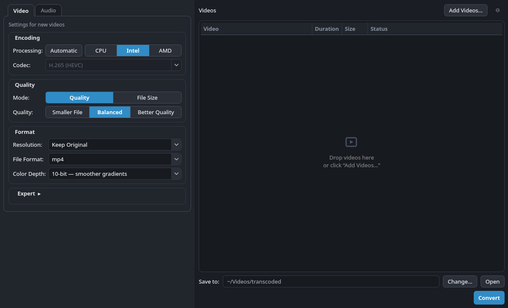
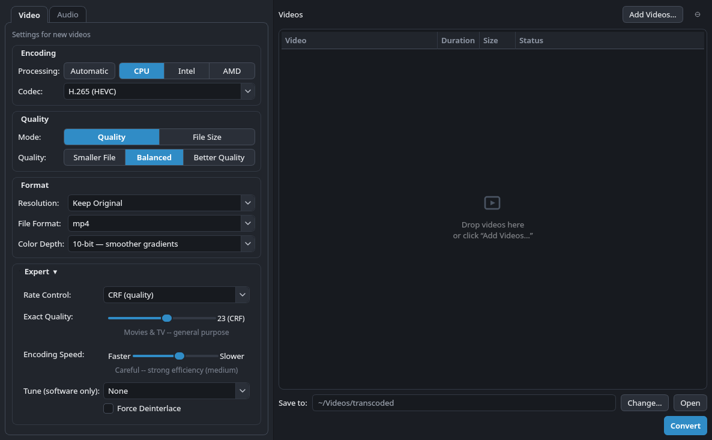
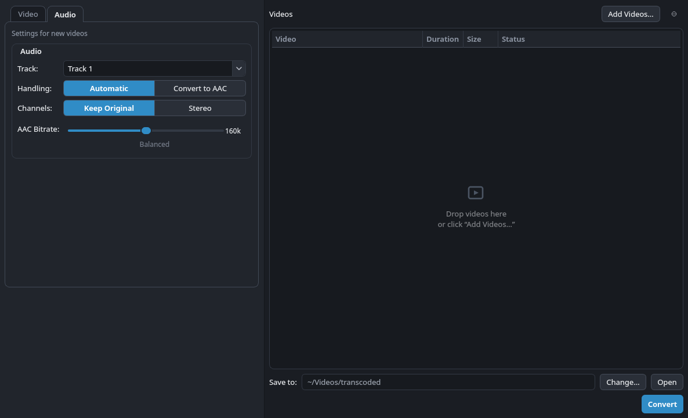

# VeloCoder

A focused desktop video transcoder built with PySide6 and ffmpeg --
originally a minimal front-end replacing HandBrake, whose QSV path is
dead on this box (see [ARCHITECTURE.md](docs/ARCHITECTURE.md)). PySide6 GUI queue, one file at
a time.

- H.265 (HEVC) / H.264 (AVC), CPU / Intel iGPU / AMD GPU processing
- Quality-first or target-file-size workflows, MP4 / MKV, 8-bit / 10-bit
- Audio: copy-through when compatible, AAC conversion, stereo downmix
- Batch queue with automatic interlace detection and live per-file edits
- An "Expert" section for exact rate-control values, tune, and deinterlace
  overrides -- Normal mode never needs it; it's there when you do

Forked from a sibling, more exposed-by-default build ("TITAN-i
Transcoder") -- same ffmpeg engine and settings model, same everything
else (shared history, unchanged). This fork's own
difference is the UI layer: Normal mode surfaces every real output/media
decision in plain language above a collapsed-by-default Expert section
holding the remaining encoder-mechanics controls -- no capability lost,
just organized around "Normal = intent, Expert = actual encoder
mechanics" instead of exposing everything flat. See the [guide](docs/GUIDE.md)
for the full breakdown of every control.

## Screenshots



 

## Install and run

VeloCoder needs Python 3.12+, PySide6 6.11+ and `ffmpeg`/`ffprobe` on `PATH`.
GPU encoding needs working VAAPI drivers (Intel `intel-media-driver`, AMD
Mesa); without them VeloCoder offers the CPU encoder only.

```
python3 -m venv .venv
source .venv/bin/activate
pip install .
velocoder
```

From a source checkout without installing, `python -m velocoder` with
`src/` on `PYTHONPATH` does the same: that's what `launch.sh` runs (with
this machine's shared venv). `scripts/install-desktop-entry.sh` adds the
checkout to the desktop menu.

Linux-first, not yet packaged for distribution (no Flatpak or bundled
ffmpeg yet).

## Project layout

```
src/velocoder/   the app: core/ (Qt-free engine), ui/ (Qt), help/
data/            desktop entry
scripts/         test runner, odcs-ui sync, desktop-entry installer
tests/           unittest suite
docs/            guide, architecture notes, screenshots
```

Details in [docs/ARCHITECTURE.md](docs/ARCHITECTURE.md#source-layout).

## Documentation

| | |
|---|---|
| [docs/GUIDE.md](docs/GUIDE.md) | Every control, the queue, Help & About |
| [docs/ARCHITECTURE.md](docs/ARCHITECTURE.md) | Source layout, the VAAPI findings behind the engine, theming, testing, known gaps |
| [docs/CONSUMER_FORK_PLAN.md](docs/CONSUMER_FORK_PLAN.md) | The plan this build's Normal/Expert design came from |

## Development

```
python3 scripts/run_tests_chunked.py
```

Runs the `unittest` suite in batches of 20, each in a fresh process (one
long process accumulates Qt resources across hundreds of `MainWindow`s).
For a single test: `python3 -m unittest tests.test_ffmpeg.TestTune -v`.
See [Testing](docs/ARCHITECTURE.md#testing) for more.

## License

MIT, see [LICENSE](LICENSE). The bundled odcs-ui is also MIT
(`src/velocoder/ui/_vendor/odcs_ui/LICENSE`).
