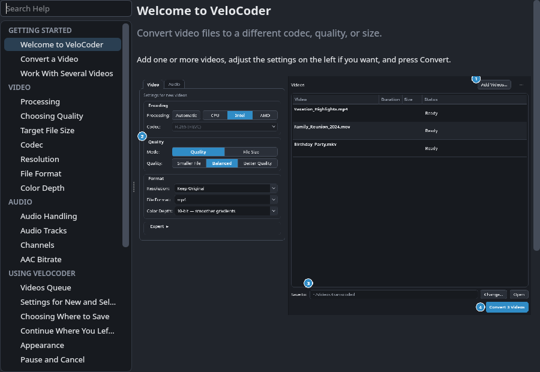
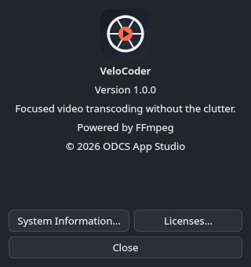
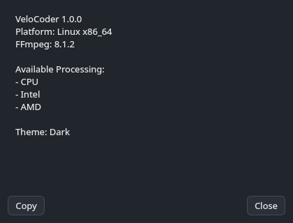

# VeloCoder guide

Every control in VeloCoder, what it does, and why it works the way it
does. For how the code is organised, see [ARCHITECTURE.md](ARCHITECTURE.md).

## Controls

The left pane is grouped into two tabs, by what kind of setting they are.
Landed on the current tab-bar look after several iterations (a plain
underline read as floating clickable text; a heavier filled-plus-outline
selected state read too heavy; an accent-colored selected border was
tried and dropped for the same reason section headings and the outer
tab-pane border are neutral elsewhere in this app — blue is reserved for
controls/progress/focus/Convert, not chrome): `border-bottom: none` on
every tab handles the seamless-with-content edge regardless of selected
state; the other three sides stay `$BORDER` for both states now, with
the selected tab distinguished by its `$BG_PANEL` fill and text colour
(selection is colour-only, never bold -- bold text is wider and shifts the layout).

Both tabs follow the same rule: **Normal mode surfaces every real
output/media decision**; an **Expert** section (collapsed by default,
Video tab only — Audio has nothing left to put in one, see below) holds
the remaining **encoder-mechanics** controls. Nothing in Expert is a
second copy of a Normal control with a friendlier label — where a
concept genuinely has both a plain-language and a precise form (Quality,
notably), the Normal control and its Expert counterpart drive the exact
same underlying value, never two independently-tracked ones.

**Video tab — Normal**

*Encoding card*
- **Processing** — which *engine* runs the encode: **Automatic**
  (recommended — picks the fastest available option on this machine,
  preferring Intel iGPU, then AMD GPU, then CPU) or an explicit **CPU**
  (software) / **Intel (iGPU)** / **AMD (GPU)** choice (the latter two
  both `hevc_vaapi`, distinguished by the `gpu_vendor` settings-dict key).
  The explicit choices are dynamic now, not a fixed list: `worker.
  detect_hardware()` probes `/dev/dri/by-path` once at startup, then runs
  a one-frame `hevc_vaapi` validation encode (`worker.validate_hevc_encode`,
  ~0.15s per GPU, using that vendor's own Quality rate-control mode) on
  each render node it finds. Intel/AMD only appear as buttons at all when
  that vendor's render node resolved *and* its validation encode worked.
  A render node alone isn't enough: with no VAAPI driver installed, or
  with a decode-only one (Fedora's own `libva-intel-media-driver` has no
  encode on a UHD 630 — RPM Fusion nonfree's `intel-media-driver` does),
  the node still exists but every hardware job would fail. A GPU that
  fails validation is logged with ffmpeg's error to the debug log and
  listed under "Unavailable Processing" in System Information — a machine with only one GPU vendor gets a
  two-way CPU/Intel or CPU/AMD row, and a machine with neither shows no
  Processing row at all (Automatic and a lone CPU choice would always
  mean the same thing, so there's nothing to ask). No NVIDIA option yet
  — NVENC support is planned as a separate, isolated pass once there's
  real NVIDIA hardware to validate it against, not bundled into Intel/AMD
  discovery. `constants.ENCODERS` is a list of `(engine
  id, gpu_vendor, label)` triples in this same CPU/Intel/AMD order,
  specifically so one ffmpeg codec (`hevc_vaapi`) can back two distinct
  menu entries; `constants.encoder_profile_key()` turns a resolved
  `(encoder, gpu_vendor)` pair back into the key `RC_MODES`/
  `RC_MODE_FRIENDLY` are keyed by (`"hevc_vaapi_intel"`,
  `"hevc_vaapi_amd"`, `"libx265"`, or `"libx264"`). Switching Processing
  carries the user's *intent* across the change rather than resetting it
  — an active Quality tier is translated to the equivalent tier on the
  new engine's own quality scale (ICQ/CQP/CRF aren't the same numbers),
  and an active File Size target is left untouched (a plain MB number
  needs no per-engine translation).
- **Codec** — H.265 (HEVC, `libx265`) or H.264 (AVC, `libx264`), the CPU
  engine's own second axis; disabled and forced to H.265 whenever
  Processing picks a hardware engine (no `h264_vaapi` wired up, hardware
  here is HEVC-only) — not hidden, since "H.265 (HEVC)" is still the
  real, correct answer for hardware, just no longer a choice. Switching
  Codec preserves the active Mode/Quality-tier/Target-Size the same way
  switching Processing does (`main_window.py`'s `_on_codec_changed`) — a real,
  previously-reported bug had this silently reset to the default
  quality value on every H.265<->H.264 switch. `main_window.py`'s
  `_current_encoder_id()` resolves Processing + Codec together into the
  one real ffmpeg encoder id everything downstream (`RC_MODES`,
  `build_args`, ...) actually keys off of. libx264 shares almost the
  entire settings surface libx265 exposes — CRF/bitrate rate control,
  10-bit, the same `ultrafast`..`placebo` preset names (confirmed
  against this exact ffmpeg build) — except its own, larger Tune list
  (see Expert below) and no equivalent of libx265's own `-x265-params`
  psycho-visual tuning (meaningless to libx264, and unlike x265's
  historically conservative defaults, libx264's own upstream defaults
  are already well-regarded).

*Quality card*
- **Mode** — **Quality** or **File Size**, a plain-language 2-way choice
  over the same `rc_mode_combo` Expert's own Rate Control drives (below)
  — picks which of the next two rows is shown.
- **Quality** (Mode = Quality) — **Smaller File** / **Balanced** /
  **Better Quality**, three fixed points on the current encoder's own
  quality scale (`constants.QUALITY_TIERS`). Exact numeric control over
  the same value lives in Expert's **Exact Quality** (below) — both
  read/write the identical `quality_value`, never two independently-
  tracked numbers.
- **Target Size** (Mode = File Size) — a target **output size in MB**,
  not a literal bitrate. The real `-b:v` ffmpeg gets is derived from
  this number and the specific file's actual duration inside
  `build_args` (`worker.target_size_to_bitrate_kbps`), after reserving
  an estimate for the audio track's own share. That reservation now
  correctly uses the *source's real bitrate* when Automatic is actually
  going to copy an already-compatible track through untouched (a
  previously-reported bug reserved the *configured* AAC bitrate even
  then, letting a copied, higher-bitrate track push the real output
  materially past the requested size — `worker.probe_audio_bitrate_kbps`,
  falling back to the configured AAC figure only when the source
  genuinely doesn't report one, e.g. common for MKV, not for MP4). A
  small caption under the field shows the resulting estimated kbps for
  whichever file is selected (or first in the queue). Setting the same
  target size across a multi-selected batch of differently-long files is
  a feature, not a bug — each file independently aims for that size
  using its own duration.

*Format card*
- **Resolution** — Keep Original / 1080p / 720p / 480p, fit within the
  box keeping aspect, never upscales. Both scale filters carry
  `force_divisible_by=2` — without it, a source whose aspect ratio
  doesn't exactly match the target box rounds one dimension to odd,
  which every pixel format this app uses (4:2:0) rejects outright.
- **File Format** — MP4 or MKV. `-movflags +faststart` is only added
  for MP4 (a mov/mp4-muxer-private option, silently ignored elsewhere).
- **Color Depth** — 8-bit or 10-bit (`main`/`nv12` vs `main10`/`p010le`
  for VAAPI; `yuv420p` vs `yuv420p10le` for CPU). H.264 specifically:
  8-bit offers the broadest playback compatibility of any option in
  this app; 10-bit H.264 needs compatible software/devices too, just
  less broadly required than H.265 does.

**Video tab — Expert** (collapsed by default)

Real encoder-mechanics controls, not a second, friendlier copy of
anything already in Normal:
- **Rate Control** — the actual `rc_mode_combo`, shown directly with
  its own real per-encoder labels (`constants.RC_MODES`): ICQ / CQP /
  VBR for Intel, CQP / VBR for AMD (**AMD's VAAPI driver, Mesa radeonsi,
  rejects ICQ outright** — confirmed via both a real `vainfo` capability
  listing and a real failed test encode), CRF / Target bitrate for
  CPU. This used to be a second Quality/File Size/Advanced button row
  here, functionally duplicating Normal's own Mode toggle with
  different labels — replaced with the real dropdown so Expert
  genuinely shows encoder mechanics instead of restating Normal.
- **Exact Quality** — the precise numeric value (same `quality_value`
  Normal's Quality tier buttons set) via a slider, range following the
  specific mode (e.g. ICQ 1–51 vs CRF 0–51 aren't the same scale, so
  this re-ranges on every encoder/rc_mode change). `setInvertedAppearance`/
  `setInvertedControls` flip the slider so **left is worse/smaller,
  right is better/larger** — every rc_mode's underlying scale runs the
  opposite way (a *lower* number means *better* quality) otherwise. A
  fuzzy tier caption underneath ("Movies & TV — general purpose", etc.)
  names what the current position is actually good for.
- **Encoding Speed** — "Faster" to "Slower" for either engine
  (`-compression_level` 1–7 for VAAPI, x265/x264's own preset ladder
  `ultrafast`…`placebo` for CPU). VAAPI's own inverted-appearance
  direction isn't a guess: timed real encodes at compression_level
  1/4/7 confirmed lower values are genuinely both slower *and* more
  size-efficient at a fixed quality target.
- **Tune (software only)** — hidden for a hardware engine (`hevc_vaapi`
  has no equivalent option). x265 (`constants.X265_TUNES`): `animation`,
  `grain`, `psnr`, `ssim`, `fastdecode`, `zerolatency`, or `None`.
  **`film` is deliberately not offered for x265** — this exact libx265
  build rejects it outright (confirmed by actually running it). x264
  (`constants.X264_TUNES`) adds `film` and `stillimage` on top of that
  same list, both confirmed to work against this exact libx264 build.
- **Force Deinterlace** — new files are sampled and this is set
  automatically (see Queue pane below); this checkbox is a manual
  override on top of that, for when detection gets a specific file
  wrong. When on: VAAPI gets `deinterlace_vaapi=rate=frame` after
  `hwupload` and before `scale_vaapi`; CPU gets `bwdif=mode=send_frame`
  before `scale`. Both explicitly pin single-rate output — bwdif's own
  default (`send_field`) silently doubles the frame rate, which isn't
  what a "just fix the interlacing" checkbox should do.

**Audio tab — Normal only** (no Audio Expert — every genuine audio
setting the backend supports is already promoted here; an Expert
section with nothing left to put in it would be worse than none)
- **Track** — narrowed to what the selected file(s) actually have
  (`worker.parse_probe_output`'s own `audio_track_count`, already probed
  for the queue table's own subtitle text) rather than a fixed Track
  1–4 regardless of source — picking a track that doesn't exist used to
  silently produce audio-less output instead of preventing the choice.
  With multiple files selected, only track indexes valid for *every*
  selected file are offered (the safe intersection).
- **Handling** — **Automatic** (copies the track through untouched when
  it's already `aac`/`ac3`/`eac3`, otherwise transcodes to AAC) or
  **Convert to AAC** (always transcodes, even from a compatible codec).
  Split out from a previously-bundled "Automatic/Convert to Stereo"
  toggle that never actually exposed copy-vs-transcode as its own real
  choice — copy-vs-transcode and channel layout are independent
  decisions.
- **Channels** — **Keep Original** or **Stereo**, split out the same
  way. Only actually does anything when the source genuinely has more
  than 2 channels (`worker.probe_audio_channels`, only probed when this
  is set at all) — checking it on an already-stereo/mono source has no
  effect. A stream copy can't remix channels, so on a source that does
  need it, this forces a transcode even when Handling would otherwise
  have copied — `-ac 2` (libswresample's own remix), not a hand-written
  `pan` filter, so it remixes correctly from whatever the source's real
  layout turns out to be.
- **AAC Bitrate** — used whenever the track is actually transcoded
  (stays adjustable even under Automatic Handling, since a source the
  copy path can't handle — DTS, PCM, ... — still needs transcoding at
  whatever this is set to). A slider over the 5 real stops (96k/128k/
  160k/192k/256k, captioned Smallest file → Highest quality) — an index
  into the fixed list, not the kbps number itself, since the real values
  aren't evenly spaced.

**Below the tabs, left side** *(VeloCoder specifically — see this fork's
own note at the top of this file. The sibling TITAN-i Transcoder app still
keeps Effective Command inline exactly as described in its own copy of
this section.)*
- **Effective Command** no longer has a visible panel in the main window at
  all. `self.command_preview` (`worker.build_args(..., probe_audio=False,
  ...)` under the hood — same function real jobs use, so it can never drift
  from what actually runs) still exists and still updates on every settings
  change; it's just never added to any layout. The only exposed entry point
  now is **Edit → Copy FFmpeg Command**, which reads the resolved argv list directly
  (`self._last_preview_args`) rather than this widget's own display text —
  `_copy_command_to_clipboard` needs no visible preview to work at all.

Theme (System/Light/Dark) and hardware-acceleration status used to sit in a
permanent, qBittorrent-style footer strip at all times — reported live as
the most generic-desktop-utility-feeling part of an otherwise much
friendlier window, so this fork's own footer is gone entirely. Theme moved
into **Edit → Settings…** (Ctrl+,) and **View → Theme**, a small `QDialog` hosting the
exact same `theme_combo` widget, reparented in on open rather than
duplicated. Hardware status is silent during normal operation, including
when no hardware acceleration exists at all — Automatic Processing
already picks the best available engine on its own, and a machine with no
GPU falls back to CPU without comment (CPU is a completely ordinary
outcome, not something worth greeting a non-technical user with on
startup). Processing's own row already reflects this directly, hiding
itself entirely rather than offering CPU/Intel/AMD choices that don't
exist (see the Processing entry above) — there's no separate startup
notice on top of it.

**Queue pane (right side)**
- **The queue itself** — a `DropTreeWidget` (flat `QTreeWidget`, no actual
  hierarchy): a real multi-column grid with a header bar, not a single-line
  list. Four columns, not the technical File/Video/Duration/Audio/Size/
  Result grid the underlying engine's own sibling app still uses — **Video**
  (the delegate-painted two-line card described next) / **Duration** /
  **Size** / **Status** (`Ready` while queued, live `Converting… NN%` while
  running, a size-change summary once done, or a short `Failed` — the
  reason itself shows on the row's second line in the error colour, in
  full in the tooltip and the Log). The chosen *output*
  settings (encoder, quality, container, …) are deliberately **not**
  repeated here — they already live in, and edit live from, the right-hand
  settings panel for whichever row is selected (see "Selecting a row edits
  it live" below), so a second copy in the grid would just be the same
  information twice.

  The **Video** column is the one with a real custom painter
  (`queue_widget._VideoCellDelegate`, installed via
  `setItemDelegateForColumn`) rather than plain `QTreeWidgetItem` text: a
  bold filename title over a muted subtitle line (codec + resolution +
  audio, e.g. "H.264 1920x1080 · AAC 5.1"), closer to a list of videos than
  a spreadsheet row. `item.text(VIDEO_COL)` is *only* ever the filename
  (set once, in `_make_queue_row`) — the subtitle lives on a second,
  distinct data role, `queue_widget.VIDEO_SUBTITLE_ROLE`
  (`Qt.UserRole + 1`), composed fresh by `_refresh_video_cell` from
  whichever of the source probe's video/audio labels and the interlace
  detector's `deinterlace` flag have landed so far (see below) — three
  independent async results that can arrive in any order, none of which
  touch the title. `STATUS_COL` still exists as a name (an alias, now for
  `VIDEO_COL` rather than the old six-column layout's `FILE_COL`) purely so
  call sites reading/writing the row's job settings dict via
  `item.data(STATUS_COL, Qt.UserRole)` stay self-explanatory about *why*
  they're touching that particular column — genuinely a different
  `Qt.UserRole` slot than the subtitle's, on the same column index, which
  is exactly the collision `VIDEO_SUBTITLE_ROLE` exists to avoid.

  `_make_queue_row` fills in the Video title/Size synchronously (no I/O
  beyond a `stat()`) and Status as `"Ready"`; the subtitle and Duration
  arrive from an async `ffprobe` metadata probe once it lands (see below).
  Drag files in from a file manager to add them, or drag existing rows to
  reorder them (`QAbstractItemView.InternalMove`; `DropTreeWidget` tells
  the two apart by whether the drag carries URLs) — reordering relies on
  Qt's own row-move handling for a flat item-per-row model, the same
  mechanism `QListWidget` used before this became a table, deliberately
  *not* `QTableWidget`, whose internal-move is cell-based rather than
  row-based and a known rough edge for exactly this kind of drag-reorder.
  Shows placeholder text when empty instead of a blank box. **Video**
  stretches to whatever the window leaves and elides long names;
  **Duration**, **Size** and **Status** are sized from the current font to
  their widest real value ("00:00:00", "1023.9GB", "1023.9GB (100%
  smaller)") by `DropTreeWidget.fit_columns`, and refit when the font or
  style changes, so the numbers you scan for are never truncated. The
  trade: a Stretch section can't be drag-resized. (Until 2026-10-07 these
  were hand-tuned px widths, and Size showed "11.2GB" as "11.2…".)
- **Source metadata probe** — each added file immediately kicks off an
  async, non-blocking `ffprobe -show_entries format=duration:stream=...`
  call (`worker.build_probe_args`/`parse_probe_output`, header-only, no
  decoding — fast even for a large file) that fills in the Video/Duration/
  Audio columns once it lands. Runs alongside the existing interlace probe
  below rather than instead of it — both append to the same
  `_detection_processes` list, so anything that already waited on that list
  (tests included) transparently waits for both. The Video cell's
  *subtitle* (see above — not `item.text()`, that's just the filename)
  depends on *three* independent async results now: the probe's own video
  codec+resolution label, the probe's audio codec+channel label (folded in
  alongside the video one now, not a separate column), and the interlace
  detector's `deinterlace` flag, appended as "(interlaced)" — they can land
  in any order, and `_refresh_video_cell` recomposes the full subtitle from
  all three pieces of stashed raw state every time any one of them arrives,
  rather than concatenating piecemeal, so the result is correct regardless
  of arrival order.
- **Interlace probe** — kicks off the same moment as the source-metadata
  probe above and flips Deinterlace on the *individual file* on or off once
  it lands (`worker.build_idet_args`/`parse_idet_output`, ~20s sample) — a
  real override in both directions, not a one-way ratchet, so a progressive
  file added after an interlaced one doesn't inherit a stale "on." Each row
  also picks up a status icon once a run starts (▶ encoding, ✓ done, ⚠
  failed — a failed row's tooltip holds the failure reason, replacing the
  Video cell's usual path tooltip specifically, since that's exactly where
  the eye already goes to see why; the Status column's own text goes to a
  short "Failed" alongside it, live percentage while running). The icon
  lives *on* the Video cell itself (`QTreeWidgetItem` supports an icon and
  text on the same column at once) rather than the Status column — a
  separate narrow column was tried first for just the icon, as unobtrusive
  as it could reasonably be made (24px, blank header), but an empty column
  with nothing in every row until a run actually starts still read as a
  stray gap rather than a deliberate part of the design (confirmed by
  feedback, not just a guess); Status itself only came later, once there
  was real per-row text worth a column of its own. `STATUS_COL` still
  exists as a name in main_window.py — an alias, now for `VIDEO_COL` (see above)
  rather than the old six-column layout's `FILE_COL` — purely so call sites
  that touch the icon/job-dict/failure-tooltip stay self-explanatory about
  *why* they're touching that column. The
  ▶/✓/⚠ glyphs are custom SVGs now (`assets/status_play_*`/`status_done_*`/
  `status_warning_*`), not `style().standardIcon(...)` — an Apple-design-
  language pass's "one icon family, one weight, throughout" moved these
  onto the same custom family Save/Delete already used, rather than the
  other way around: Save/Delete switched *away* from `standardIcon()`
  earlier specifically because `SP_TrashIcon` had a confirmed contrast bug
  (see Known gaps), so reverting them back to get a "native" icon set
  would have reintroduced that bug just to avoid drawing two more SVGs.
  Done is green, Warning is red — color reinforcing the shape, not
  carrying the meaning alone (the accessibility baseline this whole pass
  was checked against).
- **Selecting a row edits it live** — every control above is only the
  *default* baked into a file the moment it's added. Select one or more
  queued rows and the controls populate from the first one; change any
  control from there and it applies to every selected row immediately —
  no separate "Apply" step. (`_on_queue_selection_changed` populates
  controls from a selection; `_sync_settings_to_selected_queue_items`,
  reached through `_on_control_changed`, pushes control changes back out.
  `_syncing_controls_from_selection` guards the loop between them — without
  it, merely *selecting* several differently-configured rows would
  silently homogenize them to the first one's settings before any control
  was even touched.) Remove/Clear (and reordering, and selection-edits) are
  all disabled for the duration of a run (`_set_queue_editable`) —
  `TranscodeQueue.start()` snapshots the job list once, so editing the
  visible queue after Start can't affect what's actually running; it can
  only make the list lie about it, or (for selection-edits specifically)
  overwrite a finished row's now-historical settings. **Add Videos is
  deliberately exempt** — see next.
- **Adding files mid-run joins the run in progress** — dropping a file in
  (or clicking **Add Videos…**) while a run is already going doesn't just
  sit there waiting for a second click of Convert; `add_files` pushes it
  straight into `TranscodeQueue` (`queue.add_job`) and it runs once its
  turn comes up. This needed its own patch path (`TranscodeQueue.
  update_pending_job`) rather than sharing a live reference with the
  visible row, because `QTreeWidgetItem.setData`/`.data()` round-trips a
  **copy** of the job dict, confirmed empirically — the running queue's
  snapshot, taken at add time, wouldn't otherwise see the async
  interlace-detection result land moments later.
- **ODCS window model** (shared with Keep via odcs-ui): a menu bar with every
  command and its shortcut (File, Edit, Queue, View, Help), and a toolbar with
  **Add Videos…** and **Remove** leading and **Convert** trailing as the one
  primary action (Stop / Open Folder appear just before it when relevant).
  The old "More actions" overflow button is gone. **Clear Queue** is in
  **Edit**; the Queue menu mirrors the Convert/Stop buttons' state. Delete-key
  (queue focused) and the right-click context menu still reach Remove
  directly either way. Clear Queue still asks for confirmation first
  (skipped entirely if the queue is already empty) — it can discard real
  per-file setup, so a destructive action like this always confirms first.
- **Save to** (labelled **Output folder** in the sibling TITAN-i Transcoder
  app) — deliberately *not* the first thing in the window; it's a per-run
  detail, so it sits below the queue, near where it's used, not up with
  Quality/Format. Displayed as `~/Videos/transcoded` rather than the fully
  resolved absolute path (`formatting.display_path`) whenever it's under
  the home directory — friendlier to read, and avoids spelling out the
  real username on a shared screen/screenshot; `self.output_dir` itself
  is still the plain resolved `Path` everywhere it's actually used. The
  field is directly editable, not just settable via **Change…**'s browse
  dialog — typing a path doesn't check it exists (`editingFinished` just
  updates `self.output_dir`), the same as a browsed-to path already
  didn't; both get created on demand (`mkdir(parents=True,
  exist_ok=True)`) right before they're actually needed, at Convert or
  Open.
- **Open** — opens the current output folder in the desktop file manager.
- **Run status, phase-dependent** — `status_label` reads "Converting N of M
  — filename" while running (was "[N/M] Encoding filename"); underneath it,
  a plain-language **`eta_label`** ("About 8 min remaining", derived from
  the same whole-queue ETA estimate `_queue_eta_seconds` already computed)
  is the prominent number, with the detailed telemetry — fps / bitrate /
  speed / this job's own ETA / whole-queue ETA, parsed from ffmpeg's
  `-progress` stream (`TranscodeQueue._emit_stats`) — staying exactly as
  technical as before in `stats_label` right below, just visually secondary.
  All of `progress_bar`/`eta_label`/`stats_label` are hidden while idle
  (`_apply_run_phase_visuals`, `queue_controller.py`) instead of always
  showing an empty bar and dashes — idle just shows "Idle" and Convert.
  Preparing shows an indeterminate progress bar (no real fraction exists
  yet during file analysis); Converting/Paused show the full determinate
  telemetry. Checking **Stop After Current Video** (`pause_after_check`, a
  checkable action in the **Queue** menu) appends "— will stop after this
  video" to the status line, centralized through the `_set_status` helper
  every status update goes through.
- **Convert / Cancel**, bottom-right of the panel, below status/progress/
  ETA/stats rather than right under Save to — while converting, the
  progress area *is* the content, and Cancel is an action on that content,
  so it reads better trailing it. Right-anchored with Convert rightmost
  (`run_row.addStretch()` before the buttons, Convert added last), borrowing
  macOS's own dialog/sheet button convention. Cancel is a plain secondary
  button now, not red/destructive-styled — cancelling an encode isn't
  destructive in the sense deleting something permanently is. Convert's own
  label is phase-dependent: "Convert N Videos" while idle, "Preparing…"
  (disabled — no cancel path exists yet for in-flight analysis) while
  videos are still being analyzed, "Converting…" (disabled) while a job is
  running, "Resume" while paused. Cancel itself is hidden entirely (not
  just disabled) whenever there's nothing to cancel, rather than sitting
  there grayed out.
- **Finished-run summary** — `_on_all_finished` no longer collapses straight
  back to "Idle": whenever at least one video actually completed during the
  run (even a partial one, cancelled or partly failed part-way through), it
  shows the count ("4 videos converted", in `eta_label` — "3 videos
  converted · 1 failed" if any jobs failed) and a whole-run size comparison
  ("12.4GB → 4.1GB · 67% smaller", in `stats_label`, via
  `formatting.format_run_summary`) alongside a new **Open Folder** button
  (reusing the existing `_open_output_dir`) in Cancel's old slot — Convert
  stays visible too, so re-running is still one click away. The heading
  itself (`status_label`) distinguishes *why* the run ended, not just
  whether anything completed — "✓ Conversion Complete" only when every job
  actually succeeded, "Conversion Stopped" if the user clicked Cancel at
  any point (even after some jobs had already finished), "Completed with
  Issues" if it ran to completion on its own but with some failures along
  the way, cancelled taking priority if somehow both happened in the same
  run. A run where nothing ever completed falls straight back to plain
  "Idle" instead of claiming "0 videos converted". The summary (both the
  heading and the two labels/Open Folder) persists until the queue's
  contents change (add/remove/clear/undo/redo — `_refresh_idle_controls`,
  which resets `status_label` back to "Idle" too, but only when a summary
  was actually showing — it leaves an ordinary idle status, like the
  one-time no-hardware notice, alone) or another conversion begins,
  whichever comes first.
- **Log** (raw ffmpeg stderr) has no permanent panel either, collapsed or
  otherwise — **View → Show Conversion Log** (Ctrl+L) opens it in its own
  small non-modal window, reparenting the real, already-live `log_view`
  widget rather than duplicating it. `queue_list`'s own stretch factor
  simply claims the space Log used to share space with it for.

## Help & About

  

Reachable from the **Help** menu (**VeloCoder Help**, **About VeloCoder**) or F1
(Help specifically) — no permanent **?** buttons next to controls.

- **Help** (`help_window.py`'s `HelpWindow`) is a non-modal, resizable
  window: a search field and category/topic tree on the left, an
  article viewer on the right. Only one instance ever exists — F1 or
  the menu action a second time raises/focuses the existing one rather
  than opening another (same lazy-singleton pattern `_show_log_window`/
  `_open_settings_dialog` already use). Its own geometry persists across
  launches (`QSettings` key `help_window_geometry`), independent of the
  main window's own. It follows the app's Dark/Light/Match System
  theme choice — ordinary widget chrome (the search field, the tree)
  inherits the same app-level QSS every other window shares, but the
  article viewer is rich-text HTML with its own theme-derived colors
  baked in at render time, explicitly re-rendered on a theme change
  (`refresh_theme()`) since reloading the stylesheet alone doesn't
  retroactively touch already-set HTML content.
- Content lives in `help/index.json` (six categories, thirty-one
  topics, each with search keywords) + one `help/<id>.md` file per
  topic, loaded and searched by `help_content.py` — no Qt there at
  all, and no third-party markdown dependency (a small hand-rolled
  subset: headings, paragraphs, bullet lists, `**bold**`, deck text,
  callouts, and images, exactly what these articles actually use).
  Search matches title, keywords, then body text, in that priority
  order. Typing a search always keeps the article pane synchronized
  with the tree: the current topic stays selected if it's still a
  match, otherwise the first match is shown automatically, and a query
  with no matches shows a clean "No Help topics found" message rather
  than leaving whatever was on screen before. Clearing the search
  restores the full tree and the topic that was showing (or the
  Welcome topic, if the last thing on screen was that no-results
  message).
- An article's first paragraph becomes a larger, muted "deck" line
  under its title when (and only when) that whole paragraph is a
  single `**bold**` span — the article's own one-line summary, not a
  separate syntax. `> **Label**` / `> body text` lines become a
  rounded callout card (`> **Recommended**`, `> **Tip**`, `>
  **Note**`, ...), and `` embeds one of the
  five screenshots that illustrate the Quick Start flow, the Video
  tab's settings, a queue selection, the Audio tab, and Expert —
  each shipped as a dark/light pair (`help/images/*-dark.png` /
  `*-light.png`) and picked automatically for whichever theme is
  active. Screenshots establish visual context; the article's own
  text still carries the actual instruction, so a small control
  relabel or reflow doesn't make a screenshot the only thing conveying
  a step.
- The topic tree's own look is scoped to Help alone (`style.qss`'s
  `QTreeWidget#helpTopicTree` rules), not the app's general
  `QTreeWidget` styling every other tree still uses: category headings
  are smaller, muted, bold, and shown in upper case; there's no
  separator line under every topic; and the selected/hovered row is a
  genuinely rounded highlight, painted by a small custom
  `QStyledItemDelegate` (`_RoundedSelectionDelegate`) rather than
  QSS — Fusion's own native item-selection painting keeps a hard
  square corner regardless of any `border-radius` QSS gives it. The
  tree runs at `indentation()==0` for the same reason: Qt paints its
  own accent-colored current-item indicator inside any nonzero
  per-depth indent column, via a native code path nothing short of
  removing the column itself can intercept; a topic still reads as
  nested under its category through a plain text-position offset
  instead.
- Every article is short, plain-language, and consequence-first (what
  choosing an option actually does to your file, not how the encoder
  implements it) — Expert has its own category for the small minority
  of users who open that section, without surfacing implementation
  terms like VAAPI/render nodes/PCI IDs anywhere in ordinary Help.
- **About VeloCoder** (`about_dialogs.py`'s `AboutDialog`) is a small,
  fixed-size modal: icon, name, version (from the one canonical
  `constants.APP_VERSION`), tagline, an FFmpeg credit, and a copyright
  line. The icon (`main_window.py`'s `_app_icon()`, reading `assets/app_icon.svg`)
  is VeloCoder's own real app icon, not part of the light/dark themed
  icon family the rest of the UI draws from — a fixed, full-color mark
  that replaced an earlier generic play-glyph placeholder. The same
  icon is set as `QApplication`'s own `setWindowIcon()` (`main()`), so
  it's also what the taskbar/alt-tab/window switcher show for every
  VeloCoder window, not just About's. Two buttons open further modals
  from there: **System
  Information…** (version/platform/FFmpeg version/the same cached
  hardware-backend snapshot Processing's own buttons use/current
  resolved theme name, with a **Copy** button — built only from app
  constants, `platform.*`, and display names, so there is no path,
  filename, or username to accidentally leak in the first place) and
  **Licenses…** (VeloCoder's own provisional license text, FFmpeg
  attribution, and third-party notices).
